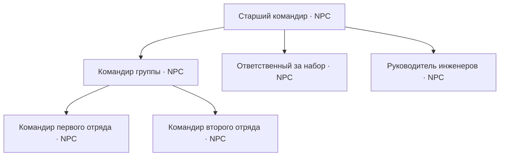

# NPC Squads 1.0.0 — дизайн-документ

Статус: проектирование. Редакция: 2026-10-02.

Документ определяет игровой цикл, правила систем и границы реализации версии 1.0.0.
Окончательный состав релиза формируется по готовности отдельных систем. Числовые параметры
с пометкой «баланс» уточняются в игровых испытаниях. Нерешённые детали перечислены отдельно.

## Область проекта

Основной цикл: развёртывание базы → подготовка подразделений → разведка и бой → удержание
или захват позиции → восстановление состава и развитие выживших бойцов.

| Система | Назначение | Статус направления |
|---|---|---|
| Командование | Физические командиры, делегирование задач и преемственность | Основная система |
| Территория | Контроль участка через Supply и борьба за опорные точки | Основная система; способ получения точек требует выбора |
| Инженеры | Укрепления, ремонт, подготовка проходов и развёртывание пунктов | Основная система |
| Опыт | Постоянные бойцы, повышение ранга и история подразделений | Основная система |
| Казармы | Последовательный набор и пополнение через очередь | Общее правило развёртывания |
| Операции | Задачи с началом, этапами и результатом | Основная система |
| Ранения | Кратковременное состояние раненого и спасение | Опциональное расширение; выключено по умолчанию |

Экономика, производство, торговля и полноценное расходование конечных ресурсов находятся
за пределами этого документа. Ресурс управления ограничивает командование; его получение
не требует предварительной реализации экономики.

Существующее ручное управление отрядами сохраняется. Территориальный режим и операции
включаются явно. Зрение, освещение, озвучка и косметические анимации развиваются отдельно.

### Базовые игровые принципы

- Автономное командование имеет живого представителя в мире на каждом уровне.
- Создание армии начинается с явного размещения командира и назначения сил и базы.
- Новые бойцы появляются в определённом месте: при ручном развёртывании или у казармы.
- Автономная сторона не создаёт командиров и отряды в случайных местах мира.
- Потеря командира нарушает управление; выжившие подчинённые могут принять его полномочия.
- Новые бойцы начинают с RECRUIT. Ранг приобретается опытом, а не выбирается при спавне.
- Казарма выпускает максимум одного NPC за установленный интервал; остальные заявки ждут.
- Разведданные имеют источник и срок актуальности. Командование не знает скрытые позиции врага.
- Смерть, отсутствие в загруженном чанке и временная недоступность — разные состояния.

### Пример игрового цикла

Игрок размещает командира и назначает ему ресурс управления. Привязанные отряды получают
задачи, казарма постепенно выпускает недостающих бойцов. Инженеры укрепляют базу и готовят
полевой Supply. Разведка обнаруживает противника у моста; командование собирает штурмовую
группу и оставляет резерв. После потери старшего командира управление принимает один из
командиров отрядов. Выжившие бойцы сохраняют опыт, пополнение приходит новобранцами.

## 1. Командование

### 1.1. Физический представитель

Командир — NPC с командной ролью, именем, фракцией, владельцем и назначенными полномочиями.
Он находится на местности, перемещается, использует укрытия и может погибнуть.
Командный NPC имеет повышенный запас здоровья относительно обычного бойца того же ранга.
Величина бонуса задаётся отдельно от опыта и уточняется балансом.

Командная роль независима от боевого класса. Стрелок может стать командиром своего отряда,
не меняя оружие и боевую специализацию. Назначение командной роли не повышает ранг.
Старший командир размещается явно через инструмент развёртывания; командир отряда может
быть назначен из уже существующего состава.

Сохранённая запись командования хранит данные и связь с NPC, но не отдаёт новые приказы
без доступного живого представителя. Гибель всех подходящих представителей прекращает
автономные решения и набор. Казарма не создаёт нового старшего командира автоматически.

### 1.2. Структура управления

Командование разделено на самостоятельные звенья. Каждое звено имеет собственную задачу,
состояние и представляющего его NPC.

| Звено | Ответственность | Представитель |
|---|---|---|
| Штаб участка | Цели, приоритеты, распределение сил между задачами | Старший командир |
| Тактическая группа | Сбор нескольких отрядов и исполнение общей задачи | Командир группы |
| Отряд | Исполнение приказа, построение, местные решения и доклады | Командир отряда |
| Набор и резерв | Очередь пополнения, готовность резервов, работа назначенных казарм | Ответственный за набор |
| Инженерные работы | Распределение строительных и ремонтных задач | Руководитель инженеров |

Каждое звено обслуживает только свою область ответственности. Штаб задаёт группе цель;
группа распределяет задачи между отрядами; командир отряда использует существующие
боевые поведения NPC. Звено набора выполняет разрешённые заявки, а не выбирает цели атаки.

Первая реализация включает штаб и командиров отрядов. Тактические группы, набор и инженеры
подключаются как отдельные звенья последовательно. Небольшой состав может совмещать
совместимые обязанности у одного NPC; потеря такого представителя затрагивает все его роли.

Звенья выполняются внутри одного игрового сервера. Разделение ответственности не требует
отдельных процессов или сетевых сервисов. Передача задачи между звеньями сохраняется
и может быть проверена независимо от работы остальных.

### 1.3. Ресурс управления

Ресурс управления — назначаемая командному звену вместимость подчинённых подразделений.
Он определяет, сколько сил можно передать под его автономное управление.
Конкретная форма выдачи — предмет, набор или действие интерфейса — уточняется отдельно.

Правила ресурса:

- Ресурс выдаётся явно и закрепляется за командным звеном с уникальным id.
- Назначение отряда резервирует часть доступной вместимости.
- Делегирование распределяет существующие полномочия между подчинёнными звеньями.
- Один отряд имеет один активный источник приказов; его назначение не дублируется.
- Передача ресурса и полномочий не создаёт бойцов и не клонирует подразделения.
- Возврат отряда под ручное управление освобождает соответствующую вместимость.
- Преемник наследует существующий ресурс звена; новое назначение не умножает его объём.

В первой модели единица вместимости соответствует одному отряду. Учёт численности NPC,
техники и мировые ограничения выполняются дополнительно. Резервные подразделения входят
в те же пределы, что и участвующие в бою.

При отсутствии преемника ресурс остаётся связанным с остановленным звеном до явной
передачи. Если выдача реализована предметом, предмет и запись полномочий должны иметь
один источник истины: ресурс не может одновременно наследоваться и выпадать второй копией.

### 1.4. Создание и назначение

1. Разместить командного NPC и выбрать фракцию, имя и командную роль.
2. Выдать ресурс управления и указать область действий в текущем измерении.
3. Назначить существующие отряды либо привязать казарму и оформить заявки на набор.
4. Назначить представителей подчинённых звеньев из доступных NPC.
5. Указать задачи: база, патрульный маршрут, участок обороны или цель наступления.
6. Включить автономное управление.

До включения NPC существует в мире, но не начинает самостоятельно создавать армию.
Создание вражеской стороны в редакторе операции также требует размещённого командира
и определённых мест развёртывания. Естественная генерация штабов и армий отсутствует.

Обычный игрок делегирует свои подразделения. Размещение сценарных сил чужой стороны
доступно автору операции или администратору. Свободный выбор фракции в тестовом инструменте
сам по себе не даёт права забрать чужой отряд.

### 1.5. Появление и движение войск

Существующие отряды передаются без пересоздания бойцов, техники, имён и опыта.
Новый состав набирается через очередь назначенной казармы. Каждый боец появляется
у базы, занимает предназначенное место в составе и физически идёт к точке сбора.

Новый отряд сначала существует как назначенный состав с незаполненными местами.
Командование отправляет его на задачу после достижения заданной готовности. Частично
укомплектованный отряд может выйти по отдельному приказу, но не считается полным.

Supply обслуживает сторону и может разрешать работу базы в территориальном режиме.
Сам Supply не создаёт NPC. Техника имеет отдельное разрешение и появляется в указанном
месте через существующий механизм развёртывания; её отсутствие не заменяется спавном
у позиции противника.

Без доступной командной цепочки заявки автономной армии приостанавливаются.
Ручная казарма сохраняет связь с владельцем-игроком и работает по собственной очереди.
Все новые и замещающие бойцы одной казармы используют один предел производительности.

### 1.6. Решения и разведка

Каждое звено получает сведения в пределах своей задачи:

- положение, состав, боезапас и готовность подчинённых;
- доклады о потерях, контактах и завершении работ;
- известные базы, цели, маршруты и состояние контролируемых точек;
- подтверждённые контакты фракции и союзников из `TeamAwareness`.

Штаб пересматривает приоритеты с ограниченной частотой. Подходящий исполнитель выбирается
по роли, готовности, расстоянию и возможности добраться. Действующая задача сохраняется,
пока остаётся приемлемой; небольшие изменения оценки не вызывают постоянную смену приказов.

| Задача | Исполнение | Условие пересмотра |
|---|---|---|
| Охрана базы | DEFEND и патруль подходов | Угроза, потеря базы или новый приоритет |
| Разведка | PATROL по назначенному маршруту | Контакт, завершение маршрута или потери |
| Сбор группы | MOVE к точке сбора | Готовность состава или истечение срока ожидания |
| Наступление | ATTACK пехоты, позиции поддержки | Захват, недоступность цели или отмена |
| Переброска резерва | MOVE/ATTACK к подтверждённой угрозе | Угроза снята или участок потерян |
| Восстановление | RETREAT к действующей базе и заявки на пополнение | Возвращение в строй |

Доступность приказов берётся из `SquadOrder.availableFor`. Танк получает позицию через
MOVE; миномёт ведёт огонь по подтверждённым контактам. Стратегическая задача не разрешает
читать текущую позицию скрытого врага.

Отход автономного отряда выполняется по приказу командного NPC. Вручную управляемый
отряд сохраняет правило выполнения приказа игрока; потери не отменяют его автоматически.

### 1.7. Гибель и преемственность

После подтверждённой гибели представителя его звено переходит в состояние передачи полномочий.
Существующие приказы продолжают исполняться; новые решения этого звена временно остановлены.
Подчинённые живые командиры сохраняют местное управление своими отрядами.

Преемник старшего командира выбирается среди живых представителей подчинённых групп
и отрядов. Порядок учитывает пригодность роли, ранг, доступность и близость; окончательная
формула приоритета уточняется балансом. Выбор фиксируется для одного события передачи,
чтобы несколько кандидатов не могли одновременно занять одну должность.

Преемник принимает ту же область ответственности, ресурс управления, подчинённые звенья
и незавершённые задачи. Его личные имя, опыт и боевой класс сохраняются. Освободившуюся
должность внутри его прежнего подразделения принимает следующий подходящий боец.
Новый NPC для закрытия командной должности не создаётся автоматически.

Передача имеет короткую задержку для нарушения согласованности атаки. Повышенный запас
здоровья применяется по новой командной роли без полного лечения и перевыдачи снаряжения.
Дистанционные приказы после передачи не требуют телепортации преемника к погибшему командиру.

Если подходящего преемника нет, звено остаётся без командования. Выжившие подразделения
исполняют последнее допустимое задание и доступны владельцу для ручного управления.
Новые наступления и автономный набор через остановленную цепочку прекращаются до явного
назначения живого представителя. При уничтожении армии её восстановление требует действий
игрока или автора сценария.

Выгрузка чанка не запускает выбор преемника и не считается смертью. Временно недоступный
представитель сохраняет полномочия, но не принимает новые решения до возобновления тика.
Критерии готовности последнего приказа и поведения при полном разрыве цепочки уточняются
при реализации, чтобы незавершённая атака не превращалась в бесконечное движение.

### 1.8. Управление и сохранение

Карточка командного NPC показывает звено, подчинённых, область ответственности, ресурс,
текущую задачу, причину ожидания и назначенного преемника, если передача уже началась.
В дереве управления видны связи между штабом, группами, отрядами и службами.

Владелец может назначать цели, передавать ресурс, делегировать подразделения, забирать их
под ручное управление и приостанавливать звенья. Пауза решений и приказ прекратить действия
различаются: второй переводит выбранные подразделения в DEFEND на текущих позициях.

Владелец отряда и источник приказа — отдельные данные. Делегирование не подменяет настоящий
UUID владельца. Сервер проверяет полномочия, уникальность назначения и вместимость.

Сохраняются командная структура, UUID представителей, ресурсы, задачи и состояние передачи.
После рестарта связи сверяются без пересоздания живых NPC. Устаревшие разведданные не
возвращаются как новые контакты. Работа звеньев и поиск маршрутов распределяются по тикам.

## 2. Территория и Supply

### 2.1. Опорная точка

В территориальном режиме Supply определяет владельца-фракцию и область контроля.
Точка хранит id, измерение, положение, название, поставившего игрока, первоначальную
и текущую фракции, радиус, состояние захвата и связанные базы.

При размещении владельцем становится зарегистрированная фракция игрока. Захват меняет
текущую контролирующую фракцию, сохраняя историю размещения. Обычные Supply старого мира
работают по существующим правилам до явного включения территориального режима.

Контроль участка используется для развёртывания, возрождения и целей войны. Он не является
общей защитой территории от строительства или разрушения блоков.

### 2.2. Радиусы и пересечения

| Область | Функция | Параметр для баланса |
|---|---|---|
| Снабжение | Пополнение рядом с блоком | Существующие 8 блоков |
| Территория | Контроль и разрешение связанных действий | Начальное значение 64 блока по горизонтали |
| Захват | Присутствие атакующих и защитников | 12–16 блоков с ограничением по высоте |

Большая территория не увеличивает дальность выдачи боеприпасов. В пересечении союзных
зон точки сохраняют собственных владельцев. Враждебное пересечение считается спорным
для нового развёртывания, но само по себе не передаёт владение блоком.

Свои и союзные зоны доступны на карте. Вражеские точки раскрываются разведкой либо
явно задаются как известные цели операции. Командование использует те же сведения.

### 2.3. Преимущества контроля

- Снабжение и назначенное возрождение доступны владельцу и союзникам.
- Связанные казармы могут работать, если условия режима требуют контролируемую опору.
- Точка становится целью обороны, наступления и условий победы операции.
- Контроль может разрешать развёртывание следующего полевого пункта.

Захват Supply не меняет сторону существующих вражеских отрядов. Утратившая опору казарма
приостанавливает выпуск NPC и сохраняет очередь. Перехват самой казармы регулируется
отдельно. При возрождении игрока проверяется текущая сторона точки; старое назначение
не разрешает появление на захваченной базе.

### 2.4. Захват

Базовая модель: одна атакующая сторона удерживает зону без защитников в течение заданного
времени. Стартовая настройка — один игрок либо два пеших боеспособных NPC и 60 секунд.
Дроны, пустая техника и пассажиры проезжающего транспорта не участвуют в захвате.

Присутствие противоборствующих сторон замораживает прогресс. После ухода атакующих
прогресс постепенно уменьшается. Союзники защищают точку и могут помогать атаке,
но не захватывают точки друг у друга. Получатель точки фиксируется в начале попытки;
несколько враждебных атакующих сторон не получают отдельные параллельные шкалы захвата.

На оспариваемой точке новое возрождение и выпуск бойцов приостанавливаются. Правило
снабжения во время спора уточняется отдельно. После захвата действует задержка активации
и уведомление сторон. Захват не продвигается в незагруженной зоне за прошедшее время.

### 2.5. Получение и размещение

| Режим получения | Игровое применение |
|---|---|
| Creative, команда или рецепт | Свободная песочница |
| Ограниченный набор развёртывания на сторону | Постепенное продвижение и перенос полевой базы |
| Заранее размещённые точки | Бой за определённый мост, деревню или аэродром |
| Развёртывание набора инженером | Подготовка плацдарма на местности |

Способ получения для обычного территориального режима остаётся открытым решением.
Рабочая модель для проверки — тыловая точка и ограниченное число полевых наборов на сторону.
Реестр учитывает установленные точки и находящиеся в обращении наборы по уникальным id;
передача предмета и повторный вход не создают дополнительные экземпляры.

В режиме фронта новые точки размещаются в своей зоне или разрешённой полосе расширения.
Начальная база имеет отдельное правило размещения. Постановка внутри вражеской зоны
требует предварительного захвата или специального разрешения сценария для плацдарма.
Сворачивание собственной неоспариваемой точки освобождает её набор для нового места.

Разрушение обычной точки прекращает контроль. Для операций допускаются точки, меняющие
сторону только захватом. Подбор разрушенного чужого блока не равнозначен получению нового
набора своей стороны. Восстановление точки, лимит после захвата и политика союзного
размещения уточняются перед реализацией переносимых пунктов.

## 3. Ранения — опциональное расширение

Механика выключена по умолчанию и не является зависимостью остальных систем.
Начальный объём ограничен состоянием лежащего раненого и коротким действием помощи.

При определённых смертельных попаданиях NPC остаётся раненым на ограниченное время.
Повторное поражение и тяжёлый взрыв могут привести к немедленной смерти. Медик или игрок
с аптечкой может вернуть его в бой с частью здоровья. Медицинский транспорт и переноска
рассматриваются как последующее расширение.

Раненый сохраняет личность, опыт и место в составе. Он не стреляет, не захватывает точки
и не выполняет командную роль, но остаётся живым при учёте численности. Казарма не создаёт
ему замену до подтверждённой гибели. При недоступности раненого командира действует
временное замещение; окончательная передача полномочий соответствует правилам командования.

Отдельные повреждения органов, множество медицинских предметов и обязательная эвакуация
каждого ранения не входят в начальный объём. Система должна согласоваться со смертельным
уроном и взрывами SBW, обработкой пассажиров и переключением опции в существующем мире.

## 4. Инженерные подразделения

### 4.1. Роль и получение

ENGINEER — боец с инженерной специализацией и оружием самообороны. Инженерный отряд
включает инженеров и прикрытие. Он развёртывается вручную либо набирается через очередь
казармы. Все новые бойцы, включая инженеров, начинают с RECRUIT.

Инженерные задачи меняют условия боя: создают позиции, поддерживают технику, открывают
проходы и закрепляют территорию. Обычное окапывание NPC под огнём остаётся отдельным
боевым поведением.

### 4.2. Задачи и интерфейс

| Действие | Выбор цели | Результат |
|---|---|---|
| Укрепить позицию | Место, направление угрозы, шаблон | Подготовленное укрытие и проходы |
| Ремонтировать | Союзная машина или область работ | Восстановление доступной повреждённой техники |
| Разобрать | Собственное сооружение или конкретное препятствие | Открытый участок по разрешённым правилам |
| Развернуть Supply | Место и назначенный набор | Зарегистрированный полевой пункт |
| Минировать / разминировать | Полоса или обнаруженная мина | Позднее расширение инженерных задач |

Предварительный план показывается на местности: ориентация, отдельные элементы, проход
для своих и недоступные места. JourneyMap используется для выбора области; точная
расстановка проверяется в мире. Полный набор действий доступен без карты.

Инженерная задача хранится отдельно от боевого приказа. Работа занимает исполнителя,
но может быть прервана непосредственной угрозой. Завершение или отмена возвращает отряд
к его обычному заданию. Руководитель инженеров распределяет работы через тот же механизм.

### 4.3. Шаблоны укреплений

| Шаблон | Состав | Требования |
|---|---|---|
| Огневая позиция | Мешки с песком, боковое укрытие, вход | Сохраняет сектор стрельбы и выход |
| Перекрытие дороги | Позиции по краям и полоса препятствий | Оставляет обозначенный проход для своих |
| Позиция миномёта | Защита расчёта и свободная площадка трубы | Не перекрывает работу заряжающего |
| Полевой пункт | Площадка Supply и небольшой периметр | Соответствует правилам размещения территории |

Первая реализация использует небольшие готовые шаблоны с поворотом. Изменение длины,
глубокие траншеи, тоннели и мосты относятся к дальнейшему развитию.

### 4.4. Выполнение и сохранение работ

Шаблон разбивается на отдельные задания. Инженер резервирует задание, подходит к месту,
выполняет действие в течение заданного времени и устанавливает один объект.
Два исполнителя не выполняют одно задание одновременно.

Перед каждым изменением повторно проверяются поверхность, занятость, доступность подхода
и выход из позиции. Недоступная часть плана получает причину остановки. Контейнеры
и существующие постройки не заменяются автоматически.

Начальная модель ограничивает работу временем и количеством объектов. Склад материалов
и производственная цепочка не требуются. Для операции может задаваться фиксированный
набор сооружений; расходование реальных предметов уточняется отдельно.

Поставленные объекты связаны с задачей, стороной и ожидаемым состоянием. Они сохраняются
после гибели инженеров. Отмена прекращает дальнейшую работу; уже построенное остаётся.
Разбор затрагивает только разрешённые объекты, которые по-прежнему соответствуют записи.
Выгрузка приостанавливает работу, рестарт возобновляет её после сверки состояния мира.

### 4.5. Ремонт техники

Инженер подходит к доступной повреждённой союзной машине и использует штатную механику
Repair Tool через адаптер SBW. В локальном исходнике подтверждены Repair Tool,
`SANDBAG` и `BARBED_WIRE`. Отдельная формула мгновенного восстановления не вводится.

Число ремонтников у одной машины ограничено. Полное восстановление, движение машины,
потеря доступа или непосредственная угроза прекращают действие. Уничтоженная техника
не восстанавливается ремонтом; разбор обломков является отдельной задачей.

### 4.6. Препятствия, мины и Supply

Постановка мин использует объекты SBW и сохраняет их сторону и владельца. Полоса имеет
ограниченный состав и известный своим проход. Вражеские мины требуют обнаружения;
разминирование выполняется отдельным действием рядом с объектом. Навигация своих
подразделений и транспорта должна учитывать известные препятствия и проходы.

Для развёртывания Supply инженерной задаче назначается конкретный набор. Передача работы
другому исполнителю не создаёт дополнительную копию. Успешное завершение фиксируется
после регистрации установленного блока. Гибель инженера и отмена имеют определённый
порядок возврата или переназначения незавершённого набора.

## 5. Опыт и постоянные подразделения

### 5.1. Получение бойца

Все новые NPC начинают с RECRUIT независимо от способа появления: ручной инструмент,
казарма, назначение командной роли или подготовка операции. Выбор ранга удаляется
из обычных экранов развёртывания и настройки казарм. Сложность противника регулируется
составом, числом резервов, укреплениями и задачами командования.

Существующие бойцы и подразделения, возвращающиеся в новую операцию, сохраняют свой опыт.
Миграция старого мира не понижает уже назначенные ранги: им сопоставляется необходимый
минимум опыта. Административные средства изменения опыта отделены от игрового найма.

### 5.2. Личность и рост

Боец имеет постоянные id, имя, класс, опыт, ранг и историю участия. Ранг развивается
по цепочке RECRUIT → REGULAR → VETERAN → ELITE. Используются существующие пределы
здоровья, точности, времени прицеливания и темпа огня `NpcRank`.

Повышение не меняет боевой класс, не перевыдаёт оружие, не пополняет боезапас и не лечит
до максимума. Обновление характеристик имеет отдельный путь: полный `NpcEntity.applyRole()`
выдаёт снаряжение и восстанавливает здоровье, поэтому для повышения не применяется.

Командная должность и связанный с ней бонус здоровья учитываются отдельно от ранга.
Назначение командиром не превращает новобранца в ELITE. При смене ранга или должности
сохраняется выбранный единый принцип переноса текущего здоровья.

### 5.3. Источники опыта

| Действие | Правило начисления |
|---|---|
| Урон противнику | Фактически снятое здоровье, предел на одну цель |
| Участие в уничтожении | Распределение участникам по вкладу |
| Выполнение этапа операции | Однократная награда реально участвовавшим бойцам |
| Лечение | Восстановление последствий боя, предел на пациента |
| Ремонт | Устранение боевых повреждений, предел на машину |
| Инженерная задача | Завершённая полезная работа, предел на задачу |

Стояние в мире, дружеский урон и сверхурон по почти погибшей цели опыта не дают.
Повторная починка, лечение или перестройка без нового полезного события не создаёт
неограниченный источник опыта. Награды операции сохраняют id запуска и этапа.

Пороги рангов и размер наград подбираются по длительности реальных столкновений.
Цель баланса — постепенное развитие за несколько боёв с заметной ценой потери ветерана.

### 5.4. Состав и пополнение

Место в составе принадлежит подразделению, личность — конкретному бойцу. После гибели
личность попадает в историю потерь. Казарма ставит заявку на нужную роль; новый NPC получает
новые id и имя, нулевой опыт и ранг RECRUIT. Опыт погибшего не наследуется.

Пополнение не использует средний ранг отряда. Существующая выдача `squad.rank` каждому
новому бойцу заменяется индивидуальным опытом. Подразделение может одновременно содержать ветеранов и новобранцев.
Средний ранг отображается как сводка, без общего бонуса всем участникам.

Выгруженный или раненый живой NPC продолжает занимать место. Заявка на замену создаётся
по подтверждённой гибели или явному удалению, а не по временному отсутствию сущности.

### 5.5. История и интерфейс

Подразделение сохраняет имя, фракцию, выполненные операции и потери. Полностью уничтоженный
постоянный отряд остаётся записью «Уничтожен». Его можно расформировать либо восстановить
новобранцами через казарму; сохранение истории не воскрешает личности погибших.

Карточка состава показывает имя, роль, должность, ранг, здоровье, опыт и статус каждого бойца.
Общий список отображает готовность и краткую сводку, например «7/7: два ветерана,
пять новобранцев». Повышения и потери сопровождаются краткими докладами.

Сохранение опытных бойцов обеспечивается обычными приказами отхода и снятием с задачи.
Обязательные усталость, пайки и график отдыха не вводятся.

## 6. Операции

### 6.1. Структура сценария

Операция определяет область, стороны, участников, начальные силы, цели, этапы
и условия результата. Шаблон отделён от конкретного запуска. Самостоятельные миссии
работают без глобальной кампании; последовательность операций добавляется позднее.

| Тип | Основная задача | Условие результата |
|---|---|---|
| Оборона | Удержать Supply или объект | Время удержания или отражение конечных атак |
| Захват | Взять указанные опорные точки | Контроль целей в течение заданного времени |
| Уничтожение | Уничтожить батарею или конкретный объект | Подтверждённая гибель цели и при необходимости выход |
| Эвакуация подразделения | Вывести назначенных бойцов | Требуемое число живых участников в зоне выхода |
| Сопровождение | Провести защищаемую машину | Прибытие машины живой или поражение при её уничтожении |

Эвакуация не требует включённых ранений. Сопровождение использует задачу следования
за движущимся объектом, а не DEFEND вокруг неизменной точки.

### 6.2. Подготовка и силы

Автор выбирает район, размещает базы и командных NPC, назначает ресурс управления,
силы, маршруты и цели. Стартовый состав может быть заранее подготовлен в мире,
передан игроками либо набран в обозначенных казармах до начала боя.

Волна атаки означает выход существующего или набранного резерва с базы. Она не создаёт
готовую группу в произвольной точке и не обходит правило одного NPC за интервал казармы.
Гибель командования запускает преемственность; при отсутствии представителя новые атаки
останавливаются. Редактор не подменяет эту потерю скрытым автономным командиром.

Новые NPC сценария также начинают с RECRUIT. Ветераны поступают из уже существующих
постоянных подразделений. Восстановление авторской копии подготовленного сценария
отделяется от обычного игрового найма и сохранения потерь действующего запуска.

### 6.3. Редактор и этапы

Экран операций позволяет выбрать тип, область, стороны, участников, базы и цели,
подготовить силы и настроить последовательность этапов. Точки выбираются инструментом
в мире или через JourneyMap. До запуска проверяются командные представители,
полномочия, доступность баз, размещение техники и заполнение обязательных полей.

Этапы могут составлять цепочку: захватить мост → удержать → провести машину.
Условия объединяются через ALL или ANY. События открывают цель, разрешают выход резерва,
задают новое задание живому командованию, активируют выход или отправляют сообщение.
Событие выполняется один раз для данного этапа и запуска, включая рестарты.

Одновременные условия победы и поражения разрешаются по заданному приоритету.
Сложность определяется силами и организацией противника; скрытое знание врага и произвольное
увеличение его урона не используются.

### 6.4. Жизненный цикл

Состояния запуска: подготовка, ожидание участников, бой, приостановлено, завершено, отменено.
При отсутствии участников таймеры и новые действия по умолчанию приостанавливаются.
Рестарт сохраняет этап, время, связи командования, очередь и выполненные события.

Запуски резервируют назначенные отряды и объекты. Один объект не управляется одновременно
двумя независимыми операциями. Присоединение к сценарию не переписывает мировую фракцию
игрока; правила назначения стороны фиксируются в настройках операции.

### 6.5. Временные и постоянные подразделения

Временные силы принадлежат запуску и обрабатываются по его правилам завершения.
Постоянные подразделения возвращают выживших с их опытом и реальными потерями.
Игрок до старта видит характер участия выбранного состава.

Каждая созданная сущность и временный блок имеют связь с запуском. Завершение прекращает
новые задачи, освобождает постоянные подразделения и показывает выполненные этапы,
потери и повышения. Опыт и история служат наградой без денежной системы.

Отмена удаляет только зарегистрированные временные объекты. Разрушения обычного мира
сохраняются. Повторный запуск не восстанавливает погибших постоянных ветеранов и не
откатывает чужие постройки. Восстановление подготовленной арены требует отдельного режима.

### 6.6. Сценарий «Мост у деревни»

Два отряда игроков атакуют Supply у моста. После захвата нужно удержать его три минуты
и провести союзную машину в зону выхода. Противник имеет физического старшего командира,
командиров отрядов, гарнизон, ограниченный резерв и казарму с последовательным набором.
Инженеры укрепляют берег и ремонтируют транспорт. Потеря штаба нарушает согласованность
контратаки; преемник восстанавливает управление, если в составе сохранился кандидат.

## 7. Производительность казарм

### 7.1. Единая очередь

Каждая казарма имеет одну очередь выпуска NPC. Первичный набор, замена погибших,
резерв и заявки операции используют её вместе. Моментальная выдача полного гарнизона
и отдельная параллельная волна пополнения отсутствуют.

Заявка содержит подразделение, незаполненное место, роль, фракцию, источник полномочий
и статус. Для одного места существует максимум одна действующая заявка.
Уже живой, выгруженный или раненый боец не считается свободным местом.

### 7.2. Темп выпуска

Казарма выпускает максимум одного NPC за `recruitIntervalSeconds`. Стартовое значение
для проверки — 30 секунд. При таком значении набор семи бойцов занимает не менее
210 секунд; интервал первого выпуска также учитывается.

Планировщик не выполняет накопленные выпуски пачкой после лагов, выгрузки или рестарта.
Успешное появление бойца запускает следующий полный интервал. Несколько казарм имеют
собственные очереди и дополнительно соблюдают ограничения армии и сервера.

Боец появляется только в подходящем месте у своей казармы. Недоступное место, потеря
контроля базы, оспаривание, отсутствие обязательного командования или достижение предела
численности приостанавливают выпуск и показывают причину. Очередь сохраняется.

### 7.3. Управление заявками

Интерфейс показывает следующую заявку, оставшееся время, длину очереди и причины ожидания.
Владелец или уполномоченный командный NPC может назначать приоритеты, отменять заявки
и переносить их на другую доступную казарму. Перенос сохраняет уникальность места
и не используется для обхода интервала выпуска принимающей базы.

Первая модель очереди обслуживает заявки по порядку, с явным приоритетом пополнения
действующего подразделения перед новым набором. Приоритеты не должны навсегда блокировать
остальные заявки; политика распределения уточняется испытаниями.

Перенастройка казармы изменяет будущий набор. Живые бойцы и ветераны не удаляются
и не пересоздаются для применения новой конфигурации. Удаление подразделения отменяет
его оставшиеся заявки. Потеря командного NPC передаёт управление очередью по правилам
преемственности или приостанавливает автономные заявки.

### 7.4. Связь с предыдущими версиями

Правило одного выпуска за интервал относится к целевой версии 1.0.0 и всем её казармам.
Текущая 0.6.0-dev сохраняет существующее поведение до отдельного изменения в её ветке.
Ручное размещение готового состава инструментом является отдельным действием;
оно не создаёт дополнительную очередь фонового пополнения.

## 8. Состояние мира и архитектура

### 8.1. Существующие механизмы

Боевые поведения SmartBrainLib остаются исполнителями движения, стрельбы, укрытия
и лечения. Командные звенья назначают задачи через текущие отряды и приказы.

| Область | Основа реализации |
|---|---|
| Состав, приказы и владение | `SquadManager`, `SquadOrder`, `SquadDeployment` |
| Разведка и союзники | `TeamAwareness`, `Diplomacy` |
| Казармы и появление бойцов | `BarracksBlockEntity`, проверка доступного места |
| Территория и возрождение | `SupplyBlockEntity`, `SupplySpawns` |
| Маршруты и транспорт | `SquadMarch`, существующий планировщик и управление техникой |
| Личность, ранг и здоровье | NBT `NpcEntity`, `NpcRank`, отдельное обновление параметров |
| Действия с объектами SBW | Порты `domain/port/`, адаптер `integration/sbw/` и необходимые миксины |

Реестр командования хранит структуру и полномочия, а обработчики отдельных звеньев
выполняют ограниченные обязанности от имени доступного живого представителя.
Это разделение исключает единый обработчик, напрямую управляющий каждым NPC армии.

### 8.2. Сохранение и загрузка

Сохраняются id подразделений, личностей и звеньев, UUID представителей, ресурсы управления,
заявки казарм, задания инженеров, точки контроля и состояние операций.
Каждая пространственная запись имеет измерение.

После загрузки выполняется сверка связей и фактического состояния. Отсутствие сущности
в текущем уровне не создаёт копию и не запускает событие смерти. Передача должности
и выпуски казармы имеют однократное завершение.

Радиус территории сам по себе не грузит чанки. Новые системы используют существующий
общий предел загрузки вокруг активных отрядов. Без доступного тика не симулируются скрытые
бои, продвижение захвата и накопленное производство NPC.

### 8.3. Сетевая модель и пределы

Решения принимает сервер. Клиент показывает состояние и отправляет действия, которые
проверяются на владение, доступность представителя и соответствие правилам системы.
Ручное управление имеет однозначный приоритет после отзыва делегирования.

Лимиты учитывают живых бойцов, резервы, выгруженные сущности и зарезервированные заявки.
Командование, казармы и операции используют единый учёт. Планирование маршрутов,
принятие решений и инженерные изменения распределяются по тикам.

Новые роли и данные получают стабильные идентификаторы; миграция сохраняет существующие
ранги и порядок старых перечислений. Клиентские интеграции не являются условием работы
выделенного сервера. Все основные действия доступны без JourneyMap.

## 9. Этапы реализации

Каждый этап имеет самостоятельную игровую проверку. Перед началом системы её параметры
и открытые решения уточняются отдельно; реализация всего документа одной задачей не требуется.

| Этап | Результат |
|---|---|
| A | Очередь казарм: один NPC за интервал, уникальные заявки и корректный учёт отсутствующих сущностей |
| B | Опыт и личности: RECRUIT при новом найме, повышение, карточка состава и новобранцы вместо погибших |
| C | Физический штаб, командиры отрядов, ресурс управления и ручное делегирование |
| D | Преемственность, отдельные командные звенья, запросы набора и резерв |
| E | Инженеры: огневая позиция, ремонт и сохранение работ |
| F | Территориальные точки Supply, захват, размещение и развёртывание инженером |
| G | Операции: оборона и захват с физическим командованием, этапами и результатом |
| Расширения | Мины, сложные укрепления, конвой, кампания и опциональные ранения |

Порядок независимых этапов может меняться. Первая проверка командования возможна
на готовых вручную размещённых отрядах; территория и инженеры для неё не обязательны.

### Ветки разработки

- `develop`: версия `0.6.0-dev`, тестирование и исправления текущего поведения.
- `feature/1.0.0`: дизайн-документ и разработка новой версии.
- Проверенные исправления из `develop` регулярно объединяются в `feature/1.0.0`.
- После готовности новой версии выполняется итоговое объединение с `develop` и проверка
  сборки, тестов, сохранений и игры. Промежуточные фичи 1.0.0 не входят в тестируемую 0.6.0-dev.

## 10. Открытые проектные решения

| Решение | Что требуется определить |
|---|---|
| Ресурс управления | Форма выдачи, получение, вместимость и правила возврата |
| Командные роли | Совмещение обязанностей, состав первого штаба и бонусы здоровья |
| Преемственность | Приоритет кандидатов, задержка, временное замещение и поведение без цепочки |
| Набор | Интервал, распределение приоритетов и ограничения нескольких казарм |
| Supply | Получение полевых наборов, число точек, снабжение при споре и разрушение |
| Инженеры | Шаблоны первого этапа, предел работ и расходование предметов |
| Опыт | Пороги, награды и перенос текущего здоровья при повышении |
| Операции | Первая миссия, правила назначения стороны и подготовка повторяемой арены |
| Активность мира | Условия работы без участников и предел загрузки командной структуры |

Отсутствие решений в этой таблице не отменяет закреплённые правила: физические командные
представители, преемственность, отсутствие случайного автоспавна армии, RECRUIT при новом
найме и последовательная очередь казарм.

## 11. Критерии приёмки

- Командная служба не действует без доступного живого представителя или назначенного заместителя.
- Гибель командира передаёт полномочия один раз и не создаёт NPC или копию ресурса.
- Потеря всех кандидатов останавливает новые автономные действия и не вызывает автоспавн штаба.
- Ручной перехват прекращает получение приказов от прежнего командного звена.
- Казарма выпускает максимум одного NPC за интервал, включая первичный набор и пополнение.
- Рестарт, лаг и выгрузка не создают ускоренный выпуск, дублирование заявок и бойцов.
- Новые бойцы имеют RECRUIT; повышение и новая должность не пополняют снаряжение и не лечат полностью.
- Гибель ветерана приводит к новому бойцу, а не наследованию его опыта заменой.
- Захват Supply учитывает текущие стороны, альянсы, доступность возрождения и выпуска казармы.
- Инженеры не дублируют работы и корректно реагируют на бой, изменение площадки и отмену.
- Операции исполняют события и выдают награды один раз; временные и постоянные силы различаются.
- Командование и карта не раскрывают скрытые позиции противника через служебное состояние.
- Старый мир сохраняет личности, ранги и ручное управление; переход новых правил проверяется отдельно.
- Системы работают без JourneyMap и на выделенном сервере с контролируемой нагрузкой.
