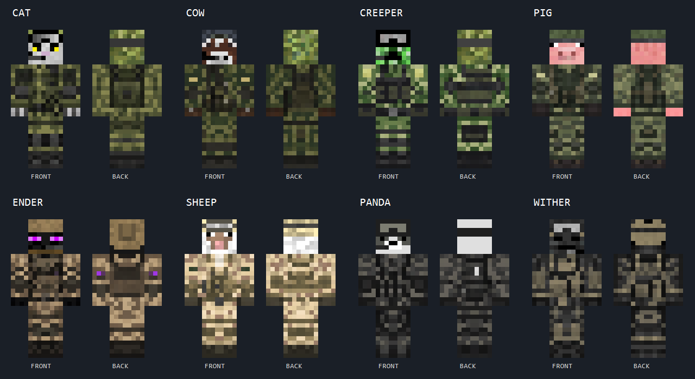

# [SBW] NPC Squads

**An NPC squad addon for [SuperbWarfare](https://github.com/Mercurows/SuperbWarfare)** — recruit, deploy,
and command your own AI-driven infantry, mortar, tank, and drone squads.

[English](#english) · [Русский](#русский)

---

## English

### What is this

[SBW] NPC Squads lets you recruit NPCs with a single tool, form them into squads, and command them like
a small AI-controlled army: riflemen, medics, snipers, machine gunners, grenadiers, mortar crews,
tank crews, and kamikaze-drone operators. Squads take cover, dig in under fire, avoid shooting
their own side, relay spotted enemies to the rest of their faction, ride and crew vehicles, and
follow orders — Attack, Defend, Patrol, Move — from a quick-command HUD or by pointing and
clicking.

### Features

- **One tool, two modes** — Recruit mode opens a GUI to pick class, rank, faction and squad
  preset and deploy it; Command mode selects squads and issues orders. Ctrl+right-click switches
  between them.
- **Squad presets** — Single, 5 (riflemen + medic), 7 (riflemen, sniper, machine gunner, medic),
  16 (large mixed squad), Mortar Crew, Tank Crew, Drone Team. 5 and 7 can deploy with a support
  vehicle; the tank crew preset lets you pick the model (ZTZ-99A / T-90A / M1A2).
- **8 factions**, each with its own uniform, team, and color — pick freely, including OPFOR
  test squads.
- **Combat AI** — cover-seeking, suppression, digging in as a last resort, partial-cover firing
  positions, friendly-fire avoidance modeled on the actual firing cone (not just a straight line),
  and faction-wide relayed contact awareness.
- **Vehicles** — NPC crews drive, escort, and gun for their squad; a squad far from its objective
  will commandeer nearby vehicles on its own. Players can now ride along in a seat next to an
  allied NPC driver instead of bumping them out.
- **Drone operators** — fly a kamikaze FPV drone at a spotted target (uses the SBW Drone Warfare
  addon's drone if installed, falls back to a stock SBW drone otherwise); other NPCs will shoot
  down or take cover from a hostile drone and alert the squad.
- **Barracks** — a placeable respawn/reinforcement point that restocks a squad's losses over
  time.
- **Quick-command HUD** — a lightweight panel (default key `B`) to pick a squad and an order
  without opening a menu.

### Requirements

- Minecraft 1.21.1 + NeoForge
- Kotlin for Forge (NeoForge build) — this mod is written in Kotlin and loads through it
- [SuperbWarfare](https://github.com/Mercurows/SuperbWarfare) — this addon builds directly on its
  weapons, vehicles, and combat systems and won't do anything without it
- SmartBrainLib — the behavior-tree AI framework every NPC's combat/movement logic runs on
- Optional: the SBW Drone Warfare addon, for the drone operator class to use its FPV drone model

### Installation

1. Install NeoForge, Kotlin for Forge, SuperbWarfare, and SmartBrainLib first.
2. Grab the latest jar from the [Releases](../../releases) page.
3. Drop it into your `mods/` folder.

### Quick start

1. Get the Squad Command Tool — there's no survival recipe yet, so grab it from Creative mode
   (Combat tab) or run `/give @s sbwnpc:squad_tool`.
2. First use asks you to pick a faction once; that's just your personal default, you can still
   deploy any faction afterward.
3. **Recruit mode** (default): right-click air to open the recruit GUI and pick class, rank,
   faction and squad preset; right-click a block to deploy it there.
4. **Ctrl+right-click** switches to **Command mode**: right-click an NPC to select it (or its
   whole squad, if it already has one — Shift+right-click clears your pick); right-click air with
   NPCs selected to open the command GUI and form/name/order the squad; right-click a hostile to
   set the selected squad's focus target.
5. Quick orders without opening a menu: press `B` for the HUD, a number key (1-9) to pick a squad,
   then a number key for an order — or `0` to order every squad you own at once.
6. Place a Barracks block (Creative-only for now too) as a squad's rally point; it slowly
   restocks that squad's losses over time.

### How this mod was made

This is a hobby project, built purely for fun. The entire codebase was written by an AI (Claude
Code) — architecture, features, bug fixes, all of it — while the meatbags did the actual
playtesting, including multiplayer sessions, and sent back bug reports on whatever broke.

Pull requests and issues are welcome and will be looked at whenever there's free time — no
guaranteed response time.

### Skins

All eight faction skins were redesigned with original military uniforms while keeping each mob's
head pixel-identical, so they stay instantly recognizable. See [`docs/skins/`](docs/skins/) for
the generation notes.

*Gameplay screenshots are still needed — if you'd like to contribute some, open an issue or a PR.*

### License

[GNU GPL v3.0](LICENSE) — see the `LICENSE` file for the full text.

---

## Русский

### Что это

[SBW] NPC Squads позволяет одним инструментом вербовать NPC, собирать их в отряды и командовать ими,
как небольшой армией под управлением ИИ: автоматчики, медики, снайперы, пулемётчики, гренадёры,
миномётные и танковые расчёты, операторы дронов-камикадзе. Отряды прячутся в укрытия, окапываются
под огнём, не стреляют по своим, передают информацию о замеченных врагах остальной фракции, ездят
и воюют в технике, выполняют приказы — Атака, Оборона, Патруль, Марш — через быструю HUD-панель
или простым наведением и кликом.

### Возможности

- **Один инструмент, два режима** — режим «Вербовка» открывает GUI выбора класса, ранга, фракции
  и пресета отряда и деплоит его; режим «Командование» выделяет отряды и отдаёт приказы.
  Переключение — Ctrl + ПКМ.
- **Пресеты отрядов** — Single, 5 (автоматчики + медик), 7 (автоматчики, снайпер, пулемётчик,
  медик), 16 (большой смешанный отряд), Mortar Crew, Tank Crew, Drone Team. Пресеты 5 и 7 можно
  задеплоить вместе с техникой поддержки; танковый расчёт — с выбором модели (ZTZ-99A / T-90A /
  M1A2).
- **8 фракций**, у каждой своя форма, команда и цвет — выбор свободный, в том числе для тестовых
  отрядов противника.
- **Боевой ИИ** — поиск укрытий, подавление, окапывание как последний рубеж, позиции с частичным
  укрытием тела при стрельбе, защита от дружественного огня по реальному конусу разброса выстрела
  (а не по прямой линии), и осведомлённость всей фракции о замеченных врагах.
- **Техника** — экипажи NPC водят, сопровождают и стреляют за свой отряд; отряд, которому далеко
  до цели, сам реквизирует ближайшую технику. Игрок теперь может подсесть пассажиром к союзному
  NPC-водителю, а не выкидывать его при посадке.
- **Операторы дронов** — запускают дрон-камикадзе по замеченной цели (использует дрон аддона SBW
  Drone Warfare, если он установлен, иначе — обычный дрон SBW); остальные NPC сбивают вражеский
  дрон или прячутся от него и поднимают тревогу в отряде.
- **Казарма** — устанавливаемая точка возрождения/пополнения, которая со временем восстанавливает
  потери отряда.
- **Быстрое командование через HUD** — лёгкая панель (по умолчанию клавиша `B`) для выбора отряда
  и приказа без открытия меню.

### Требования

- Minecraft 1.21.1 + NeoForge
- Kotlin for Forge (сборка для NeoForge) — мод написан на Kotlin и грузится через него
- [SuperbWarfare](https://github.com/Mercurows/SuperbWarfare) — аддон построен прямо поверх его
  оружия, техники и боевой системы и без него не работает
- SmartBrainLib — фреймворк поведенческих деревьев, на котором держится весь боевой/навигационный
  AI NPC
- Опционально: аддон SBW Drone Warfare — чтобы оператор дрона использовал его модель FPV-дрона

### Установка

1. Сначала установи NeoForge, Kotlin for Forge, SuperbWarfare и SmartBrainLib.
2. Скачай последний jar со страницы [Releases](../../releases).
3. Положи его в папку `mods/`.

### Быстрый старт

1. Получи Squad Command Tool — крафта пока нет, бери из креатива (вкладка Combat) или команду
   `/give @s sbwnpc:squad_tool`.
2. При первом использовании инструмент попросит один раз выбрать фракцию — это просто твой
   дефолт, деплоить другие фракции можно и дальше свободно.
3. **Режим «Вербовка»** (по умолчанию): ПКМ по воздуху открывает GUI выбора класса, ранга,
   фракции и пресета отряда; ПКМ по блоку — деплой на этом месте.
4. **Ctrl + ПКМ** переключает в **режим «Командование»**: ПКМ по NPC выделяет его (или весь его
   отряд, если он уже в отряде — Shift + ПКМ сбрасывает выбор); ПКМ по воздуху с выделенными NPC
   открывает GUI командования, где отряд формируется, называется и получает приказ; ПКМ по врагу
   ставит его фокус-целью выбранного отряда.
5. Быстрые приказы без меню: клавиша `B` — HUD, цифра (1-9) — выбор отряда, следующая цифра —
   приказ; `0` — приказ сразу всем своим отрядам.
6. Поставь блок Barracks (тоже пока только из креатива) как точку сбора отряда — он постепенно
   восполняет потери отряда.

### Как это сделано

Это хобби-проект, сделанный просто ради развлечения. Весь код написан ИИ (Claude Code) —
архитектура, фичи, багфиксы, всё — а тестированием (в т.ч. в мультиплеере) занимаются кожаные
мешки, которые потом присылают баг-репорты о том, что сломалось.

PR и issue приветствуются и будут рассмотрены в свободное время — без гарантий по срокам.

### Скины

Все восемь фракционных скинов переоформлены в оригинальной военной форме с сохранением исходной
головы каждого моба пиксель-в-пиксель, чтобы они оставались мгновенно узнаваемыми. Подробности
генерации — в [`docs/skins/`](docs/skins/).

*Скриншотов геймплея пока нет — если хочешь помочь, открой issue или PR.*

### Лицензия

[GNU GPL v3.0](LICENSE) — полный текст в файле `LICENSE`.
