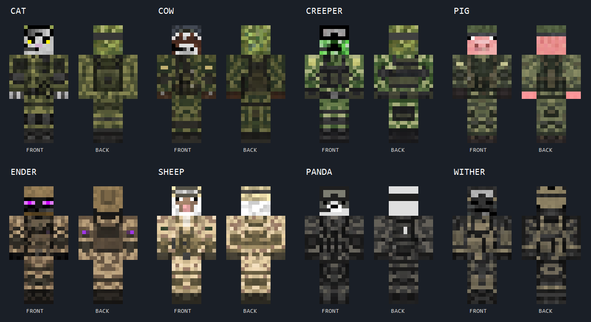

# [SBW] NPC Squads

**An NPC squad addon for [SuperbWarfare](https://github.com/Mercurows/SuperbWarfare)** — recruit, deploy,
and command your own AI-driven infantry, mortar, tank, drone, and helicopter squads.

---

## What is this

[SBW] NPC Squads lets you recruit NPCs with a single tool, form them into squads, and command them like
a small AI-controlled army: riflemen, medics, snipers, machine gunners, grenadiers, mortar crews,
tank and helicopter crews, and kamikaze-drone operators. Squads take cover, dig in under fire, avoid shooting
their own side, relay spotted enemies to the rest of their faction, ride and crew vehicles, and
follow orders — Attack, Defend, Patrol, Move — from a quick-command HUD or by pointing and
clicking. Supply points keep them equipped, boats carry them across water, and radio reports tell
you when they make contact, lose men, need ammunition, or reach their objective.

## Version 1.0.0 design

[PLAN-1.0.0.md](PLAN-1.0.0.md) defines the next version: physical NPC commanders with delegated
authority and succession, sequential barracks recruitment, earned ranks, engineering squads,
territorial Supply points, and operations. These systems are being designed on `feature/1.0.0`;
`develop` contains the released `0.6.0`. The recruitment queue is implemented
on `feature/1.0.0`; the remaining systems are planned features, not part of
the current release.

## Requirements

- Minecraft 1.21.1 + NeoForge 21.1.203 or newer
- Kotlin for Forge 5.8.0 or newer (NeoForge build)
- [SuperbWarfare](https://github.com/Mercurows/SuperbWarfare) 0.8.9.1 or newer
- SmartBrainLib 1.16.11 or newer
- Optional: the SBW Drone Warfare addon, for the drone operator class to use its FPV drone model
- Optional: [JourneyMap](https://www.curseforge.com/minecraft/mc-mods/journeymap) 6.x — your squads,
  their objectives and the enemies your side has spotted on the map, and orders given from it

## Installation

1. Install NeoForge, Kotlin for Forge, SuperbWarfare, and SmartBrainLib first.
2. Grab the latest jar from the [Releases](../../releases) page.
3. Replace the previous NPC Squads jar in your `mods/` folder with the new one.

## Key conflicts

A few mods often installed alongside bind the same keys as SuperbWarfare, and both actions fire on
one press. Rebind the other mod's key under *Options → Controls → Key Binds*: click the binding
and press the new combination, `Ctrl` included.

| Key | SuperbWarfare | Clashes with | Suggested |
|---|---|---|---|
| `R` | Reload | Iris — *Reload Shaders* | `Ctrl + R` |
| `N` | Fire mode | JourneyMap — *Waypoint Manager* | `Ctrl + N` (the list is also a button on the fullscreen map) |

## How this mod was made

This is a hobby project, built purely for fun. The entire codebase was written by an AI (Claude
Code and Codex) — architecture, features, bug fixes, all of it — while the meatbags did the actual
playtesting, including multiplayer sessions, and sent back bug reports on whatever broke.

Pull requests and issues are welcome and will be looked at whenever there's free time — no
guaranteed response time.

## Features

- **8 factions** with distinct uniforms and colours; deploy friendly or hostile squads.
- **Combat AI** that takes cover, reacts to suppression, avoids friendly fire and shares contacts.
- **Ground and water transport** — squads drive, crew mounted guns, plan routes around terrain and
  cross water by boat. Amphibious vehicles travel between land and water.
- **Drone operators** attack with kamikaze drones; other NPCs shoot down or take cover from them.
- **Helicopters** — Mi-28 gunships and AH-6 transports with NPC pilots and gunners. Aircraft remain
  visible out to 512 blocks. Surviving crew can take over if the pilot is killed.
- **Logistics and reports** — Barracks replace losses, Supply replenishes equipment, and squads
  report contacts, casualties and ammunition shortages to their owner.

## Where everything is

| Thing | Where to get it | What it does |
|---|---|---|
| **Squad Command Tool** (`sbwnpc:squad_tool`) | Creative, *Superb Warfare Items* tab — or `/give @s sbwnpc:squad_tool` | Deploys NPCs and commands squads. No recipe: in survival you are handed one on joining and on respawning whenever you have none. |
| **Barracks** (`sbwnpc:barracks`) | Same tab — or `/give @s sbwnpc:barracks` | A placed block that garrisons a squad and keeps it at strength. |
| **Supply Point** (`sbwnpc:supply`) | Same tab — or `/give @s sbwnpc:supply` | Automatically resupplies friendly NPCs within 8 blocks; right-click for a player kit or respawn point. |
| **Quick-command HUD** | Key `Z`, rebindable under controls category *SBW NPC Squads* | Pick a squad and an order without opening a menu. |

On first use the tool asks you to pick a faction once. That is only your own default — you can
still deploy any of the eight afterwards, including hostile ones to fight against.

## Using the tool

Two modes, switched with **Ctrl + right-click on air**. The current one is on the item tooltip.

**Recruit mode — what gets deployed**

- **Right-click air** opens the deploy config: preset, class (Single only), rank, faction, and the
  vehicle or airframe where the preset has one.
- **Right-click a block** deploys it there, lined up abreast and facing you.
- Presets: `Single`, `5: Riflemen`, `7: Standard`, `16: Large`, `32: Company`, `Mortar Crew`, `Tank Crew`
  (ZTZ-99A / T-90A / M1A2), `Drone Team`, `Heli Crew` — Mi-28 gunship or AH-6 transport, and the
  airframe decides which crew comes with it. `5` and `7` can bring a LAV-25 / LAV-150 / BMP-2.
- Ranks go `RECRUIT → REGULAR → VETERAN → ELITE`: more health, tighter spread, quicker reactions.
- Anything bigger than a single NPC is formed into a squad automatically, holding where it landed.

**Command mode — what they do**

- **Right-click an NPC** selects it; particles above individually selected NPCs mark the selection.
  One that is already in a squad selects the whole squad.
  Shift + right-click clears the selection.
- **Right-click air** opens the squad screen.
- **Right-click a block** with a squad selected sets that squad's objective.
- **Right-click a hostile** focuses the selected squad on it — hunted under Attack, guarded
  against under Defend.

## The squad screen

One row per squad, scrollable, with the footer buttons under the list:

- **Order** cycles through the orders that squad can actually carry out.
- **Objective** arms a click: the next block you right-click is where the squad works from.
- **Focus** arms the same thing on an entity instead.
- **R** renames · **X** disbands (the NPCs stay, the squad doesn't) · **DEL** deletes the squad
  and everything in it, vehicles included.
- **Routes** opens patrol routes: add one, right-click blocks to drop waypoints, finish, then
  assign it to a squad. A squad with a route walks it under Patrol.
- **Reports** switches your squads' chat radio reports on or off; the setting is saved per world.

There is no limit on how many squads you run. The HUD's number keys reach the first nine;
disbanding one moves the rest up into the freed numbers.

## Orders

| Order | What it means | Who can be given it |
|---|---|---|
| **Defend** | Hold near the objective, don't chase far | Everyone except tank crews |
| **Patrol** | Roam within 40 blocks of the objective, or walk the assigned route | Infantry |
| **Attack** | Advance on the objective; AH-6 circles it for its bench gunners | Everyone except tank crews |
| **Move** | Travel to the objective, then hold or land | Infantry, tank crews, helicopters |
| **Barrage** | Shell a 40-block area around the objective instead of one point | Mortar crews |
| **Retreat** | Fall back to the objective, then hold; helicopters land there | Everyone |

Tank crews take **Move** and **Retreat** — they fight from the tank by themselves. A Mi-28 gunship takes
Attack / Defend / Move / Retreat and attacks from a standoff hover. An AH-6 uses Defend to patrol
low with its door gunners, Move and Retreat to carry the squad and land, and Attack to circle the
objective with its gunners facing inward. AH-6 Attack stays active until another order or a forced
withdrawal. JourneyMap menus offer the orders available to the selected squad types.

In enemy contact, defenders and patrols keep a useful firing position while the target is within
twice their class's normal combat range. A target farther away can prompt an approach of at most
24 blocks from the original post, then they stop and fire. They do not chase a target merely to
restore their preferred distance. Snipers, medics and machine gunners use rear positions during
combat; without an enemy present they travel to the ordered objective with everyone else.

## The Barracks

Right-click a Barracks you placed, choose its composition, then press **Apply recruitment**.
It creates an empty squad and recruits one NPC every `recruitIntervalSeconds` (10 seconds by
default, in the world's `serverconfig/sbwnpc-server.toml`). The first recruit also waits a full
interval: seven soldiers take at least 70 seconds. Initial recruits and replacements share one
queue across every squad assigned to that Barracks. Replacements have priority, with one initial
recruit admitted after three replacements when both are waiting.

The **Queue** button shows the actual release order, next recruit, time remaining, and any reason
production is waiting. The queue and countdown survive saves; unloading pauses recruitment, and
reloading never releases a catch-up wave. Unloaded soldiers keep their places. Older saves wait
for unknown member roles to load before recruiting replacements. No safe spawn space means the
request waits. Drone operators nearby still get their drones replenished independently.

Applying new settings preserves living soldiers and changes future recruitment. Surplus soldiers
stay until they die; their retired places are not refilled. Choosing another faction releases the
old squad to manual control and queues a new one on the selected side. Only the player who placed
the Barracks can configure it. Disbanding or deleting its garrison cancels that recruitment order.
Support vehicles and mortars deploy once the initial crew is assembled; replacements do not
generate additional vehicles.

An assigned Barracks keeps ticking away from players. Deleting or disbanding its garrison from
the squad screen stops production until you configure it again.

Destroying the Barracks leaves the squad alive but stops reinforcement.

## Supply points

A Supply serves the faction of the player who placed it and that faction's allies. Friendly NPCs
within 8 blocks automatically receive their issued ammunition, grenades, medical kit, mortar
shells and drones. Between fights, NPCs low on ammunition return to the nearest friendly Supply;
when nearly empty, they can withdraw there while fighting. Mortar loaders carry 30 shells and
fetch more from Supply when they run out.

Right-click a friendly Supply to choose a class kit and one of that class's weapons. Kits provide
the gun, ammunition, class equipment and your side's helmet and vest, topping up what you are
missing. The machine gunner kit includes an RPG with TBG rockets. With Drone Warfare installed,
the drone operator kit uses its FPV drones and goggles, plus a monitor; otherwise it uses SBW drones.

**Respawn here** makes it your spawn point while the block remains friendly and has room above
it. A bed or respawn anchor replaces that choice. If the Supply is destroyed, inaccessible or no
longer friendly, you return to world spawn. Supply stock is currently unlimited. A Supply placed
before it had logistics support may need to be broken and placed again.

## Worth knowing

- Squads take cover, dig in when badly hurt, and won't fire through a squadmate — or through a
  parked vehicle.
- A squad with a distant objective commandeers a vehicle nearby and drives. You can ride along in
  a free seat without bumping the NPC driver out.
- They only see what is in front of them, so they can be flanked — but a shot at them, or a
  contact their own side calls in, turns them around.
- NPCs can see through glass but will not fire through it. Three blocks
  of grass or fern along the sightline hide a target. Enemy footsteps are heard within 4 blocks
  when walking, 8 when running and 3 when landing; crouching is silent.
- Every NPC has one medical kit and uses it on itself when wounded in cover; Supply replenishes it.
- Machine gunners carry a launcher on the side for anything riding a vehicle; infantry stays the
  machine gun's job.
- NPCs throw grenades at covered enemies or when pinned, checking reach, obstacles and nearby allies.
- Mortar crews only shell what their own side has actually seen. Out of reach of the target, they
  break the mortar down, carry it closer and set it back up.
- A killed NPC drops the weapon in its hands with a 3.75% chance (with only its loaded magazine), each
  piece of armour with a 1.25% chance, a box of ammunition for its gun with an 18.75% chance, and one of
  the grenades it had left with a 1.25% chance, whoever killed it.
  Ammunition without a box item, such as heavy rounds and rockets, drops as individual items.

## Skins

## License

[GNU GPL v3.0](LICENSE) — see the `LICENSE` file for the full text.
