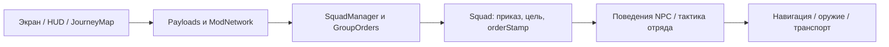

# Карта проекта

Этот документ помогает найти код конкретной механики и понять, какие соседние файлы затронет изменение. Подробности тактического модуля находятся в [TACTICS-ARCHITECTURE.md](TACTICS-ARCHITECTURE.md).

## Откуда начать

Большая часть кода — Kotlin в `src/main/kotlin/com/sbwnpc/squad/`. В таблицах ниже пути отсчитываются от этой папки. Java используется для mixin-вставок в Minecraft и SuperbWarfare.

| Путь от корня репозитория | Содержимое |
|---|---|
| [src/main/kotlin/com/sbwnpc/squad/](../src/main/kotlin/com/sbwnpc/squad/) | Основной код мода |
| [src/main/java/com/sbwnpc/squad/mixin/](../src/main/java/com/sbwnpc/squad/mixin/) | Вставки в классы Minecraft и SuperbWarfare |
| [src/main/resources/](../src/main/resources/) | Текстуры, модели, переводы, metadata и список mixin |
| [src/test/kotlin/com/sbwnpc/squad/](../src/test/kotlin/com/sbwnpc/squad/) | Автоматические проверки, расположенные по тем же модулям |
| [gradle.properties](../gradle.properties) | Версия мода, Minecraft и зависимостей |
| [build.gradle.kts](../build.gradle.kts) | Сборка, тесты, зависимости, генерация `BuildFlags` |
| [settings.gradle.kts](../settings.gradle.kts) | Подключение локального checkout SuperbWarfare |
| `SuperbWarfare/` | Отдельный локальный репозиторий зависимости; не входит в git этого проекта |
| `build/` | Результаты сборки, отчёты тестов и сгенерированные файлы |
| [PLAN-1.0.0.md](../PLAN-1.0.0.md) | План версии; описание намерений, а не подтверждение реализации |
| [CLAUDE.md](../CLAUDE.md) | Правила работы с репозиторием и технические особенности |

В IDE начни с поиска имени файла или символа: `GunAttackBehaviour`, `SquadOrder`, `SupplyPoints`. Через Find Usages можно перейти к вызывающему коду и связанным тестам.

## Основные модули

| Модуль | За что отвечает | Точки входа |
|---|---|---|
| Инициализация | Подключение портов, регистраций и конфигов | [SquadMod.kt](../src/main/kotlin/com/sbwnpc/squad/SquadMod.kt), [init/](../src/main/kotlin/com/sbwnpc/squad/init/) |
| Серверные события | Общие обновления и очистка временных данных между мирами | [ServerTick.kt](../src/main/kotlin/com/sbwnpc/squad/ServerTick.kt), [ServerLifecycle.kt](../src/main/kotlin/com/sbwnpc/squad/ServerLifecycle.kt) |
| NPC | Сущность, её Brain, состояние, поза, восстановление после застревания | [entity/NpcEntity.kt](../src/main/kotlin/com/sbwnpc/squad/entity/NpcEntity.kt), [entity/NpcStuckRecovery.kt](../src/main/kotlin/com/sbwnpc/squad/entity/NpcStuckRecovery.kt) |
| Индивидуальный AI | Стрельба, укрытия, лечение, снабжение, движение, техника | [entity/ai/](../src/main/kotlin/com/sbwnpc/squad/entity/ai/) |
| Бой | Общие расчёты видимости, угроз, огня, формаций и безопасных позиций | [combat/](../src/main/kotlin/com/sbwnpc/squad/combat/) |
| Тактика отряда | Выбор манёвра, состояния, фазы, назначения и диагностика | [combat/tactics/](../src/main/kotlin/com/sbwnpc/squad/combat/tactics/) |
| Отряды и приказы | Состав, владелец, приказы, выделение, развёртывание, сохранение | [squad/Squad.kt](../src/main/kotlin/com/sbwnpc/squad/squad/Squad.kt), [squad/SquadManager.kt](../src/main/kotlin/com/sbwnpc/squad/squad/SquadManager.kt) |
| Описания NPC | Классы, ранги, пресеты, фракции и модели техники | [npc/](../src/main/kotlin/com/sbwnpc/squad/npc/) |
| Фракции и дипломатия | Команды scoreboard, враждебность, союзы | [team/](../src/main/kotlin/com/sbwnpc/squad/team/), [squad/PlayerFactionRegistry.kt](../src/main/kotlin/com/sbwnpc/squad/squad/PlayerFactionRegistry.kt) |
| Длинные маршруты | Планирование движения по местности и ограничения вычислений | [route/](../src/main/kotlin/com/sbwnpc/squad/route/) |
| Техника | Вода, воздушное пространство, вертолёты, питание и принадлежность водителя | [vehicle/](../src/main/kotlin/com/sbwnpc/squad/vehicle/) |
| Казармы и Supply | Блоки, очередь пополнения, наборы снаряжения и респавн | [block/](../src/main/kotlin/com/sbwnpc/squad/block/), [block/entity/](../src/main/kotlin/com/sbwnpc/squad/block/entity/) |
| Предмет управления | Использование инструмента, конфигурация и выдача игроку | [item/SquadToolItem.kt](../src/main/kotlin/com/sbwnpc/squad/item/SquadToolItem.kt) |
| Сеть | Сообщения клиент ↔ сервер и серверная обработка действий | [network/Payloads.kt](../src/main/kotlin/com/sbwnpc/squad/network/Payloads.kt), [network/ModNetwork.kt](../src/main/kotlin/com/sbwnpc/squad/network/ModNetwork.kt) |
| Интерфейс | Экраны, HUD, клавиши, клиентские снимки состояния, рендер NPC | [client/](../src/main/kotlin/com/sbwnpc/squad/client/), [client/screen/](../src/main/kotlin/com/sbwnpc/squad/client/screen/) |
| Карта | Серверная выдача данных, клиентское состояние, JourneyMap | [map/MapFeed.kt](../src/main/kotlin/com/sbwnpc/squad/map/MapFeed.kt), [integration/journeymap/](../src/main/kotlin/com/sbwnpc/squad/integration/journeymap/) |
| Контракты с SBW | Интерфейсы оружия, транспорта, гранат, снаряжения и их подключения | [domain/port/](../src/main/kotlin/com/sbwnpc/squad/domain/port/) |
| Реализация интеграции | Вызовы конкретных классов и API SuperbWarfare | [integration/sbw/](../src/main/kotlin/com/sbwnpc/squad/integration/sbw/) |
| Настройки и диагностика | Конфиги, группы логов, измерение нагрузки | [config/](../src/main/kotlin/com/sbwnpc/squad/config/), [combat/DebugFlags.kt](../src/main/kotlin/com/sbwnpc/squad/combat/DebugFlags.kt), [util/PerfProbe.kt](../src/main/kotlin/com/sbwnpc/squad/util/PerfProbe.kt) |

## Где менять конкретную механику

### Поведение NPC и бой

В [NpcEntity.kt](../src/main/kotlin/com/sbwnpc/squad/entity/NpcEntity.kt) ищи `getSensors`, `getCoreTasks`, `getIdleTasks`, `getFightTasks`: здесь поведения подключаются к Brain. Реализации находятся в `entity/ai/`. Общие вычисления вынесены в `combat/`.

| Что нужно изменить | Где смотреть |
|---|---|
| Выбор и обнаружение противника | [SquadTargetSensor.kt](../src/main/kotlin/com/sbwnpc/squad/entity/ai/SquadTargetSensor.kt), [DetectionSightline.kt](../src/main/kotlin/com/sbwnpc/squad/combat/DetectionSightline.kt), [Vision.kt](../src/main/kotlin/com/sbwnpc/squad/combat/Vision.kt) |
| Лучи для стрельбы и укрытий | [Sightline.kt](../src/main/kotlin/com/sbwnpc/squad/combat/Sightline.kt); сравни с отдельным `DetectionSightline` перед изменением |
| Стрельба, дистанции, очереди, перезарядка | [GunAttackBehaviour.kt](../src/main/kotlin/com/sbwnpc/squad/entity/ai/GunAttackBehaviour.kt), [OpeningFire.kt](../src/main/kotlin/com/sbwnpc/squad/entity/ai/OpeningFire.kt), [npc/NpcClass.kt](../src/main/kotlin/com/sbwnpc/squad/npc/NpcClass.kt) |
| Вызовы оружейного API SBW | [integration/sbw/SbwGuns.kt](../src/main/kotlin/com/sbwnpc/squad/integration/sbw/SbwGuns.kt), [domain/port/Guns.kt](../src/main/kotlin/com/sbwnpc/squad/domain/port/Guns.kt) |
| Уход в укрытие и выход для стрельбы | [SeekCoverBehaviour.kt](../src/main/kotlin/com/sbwnpc/squad/entity/ai/SeekCoverBehaviour.kt), [CoverSearch.kt](../src/main/kotlin/com/sbwnpc/squad/entity/ai/CoverSearch.kt), [CombatPosition.kt](../src/main/kotlin/com/sbwnpc/squad/combat/CombatPosition.kt) |
| Реакция на попадания и неизвестного стрелка | [IncomingFire.kt](../src/main/kotlin/com/sbwnpc/squad/combat/IncomingFire.kt), [BlindReturnFireBehaviour.kt](../src/main/kotlin/com/sbwnpc/squad/entity/ai/BlindReturnFireBehaviour.kt), [SuppressionEvents.kt](../src/main/kotlin/com/sbwnpc/squad/combat/SuppressionEvents.kt) |
| Безопасность стрельбы рядом с союзниками | [FriendlyFireGuard.kt](../src/main/kotlin/com/sbwnpc/squad/combat/FriendlyFireGuard.kt), [FireAllocation.kt](../src/main/kotlin/com/sbwnpc/squad/combat/FireAllocation.kt) |
| Разведение стрелков по позициям | [FiringSpots.kt](../src/main/kotlin/com/sbwnpc/squad/combat/FiringSpots.kt), `TacticalPositions.kt`, `CoverSearch.kt` |
| Лечение | [MedicHealBehaviour.kt](../src/main/kotlin/com/sbwnpc/squad/entity/ai/MedicHealBehaviour.kt), [SelfTreatBehaviour.kt](../src/main/kotlin/com/sbwnpc/squad/entity/ai/SelfTreatBehaviour.kt) |
| Гранаты и уклонение | [GrenadeUseBehaviour.kt](../src/main/kotlin/com/sbwnpc/squad/entity/ai/GrenadeUseBehaviour.kt), [GrenadeThrowBehaviour.kt](../src/main/kotlin/com/sbwnpc/squad/entity/ai/GrenadeThrowBehaviour.kt), [GrenadeEvadeBehaviour.kt](../src/main/kotlin/com/sbwnpc/squad/entity/ai/GrenadeEvadeBehaviour.kt) |
| Тактические манёвры | [TacticalRules.kt](../src/main/kotlin/com/sbwnpc/squad/combat/tactics/TacticalRules.kt) выбирает манёвр; соответствующий класс State выполняет его; [подробная карта](TACTICS-ARCHITECTURE.md) |
| Защищённая высота снайпера и пулемётчика | [DefensiveOverwatch.kt](../src/main/kotlin/com/sbwnpc/squad/combat/tactics/DefensiveOverwatch.kt), [TacticalPositions.kt](../src/main/kotlin/com/sbwnpc/squad/combat/tactics/TacticalPositions.kt) |

### Приказы, движение и техника

`route/` содержит планирование маршрутов по миру. `squad/RouteManager.kt` хранит **патрульные маршруты, записанные игроком**. Это разные задачи, несмотря на похожие названия.

| Что нужно изменить | Где смотреть |
|---|---|
| Доступные команды по классу отряда | [squad/SquadOrder.kt](../src/main/kotlin/com/sbwnpc/squad/squad/SquadOrder.kt), метод `availableFor`; его потребители — экраны, HUD, JourneyMap, менеджер |
| Выполнение приказа пехотой | [SquadOrderBehaviour.kt](../src/main/kotlin/com/sbwnpc/squad/entity/ai/SquadOrderBehaviour.kt) |
| Длинный марш, точки движения и прогресс | [SquadMarch.kt](../src/main/kotlin/com/sbwnpc/squad/entity/ai/SquadMarch.kt), [MarchProgress.kt](../src/main/kotlin/com/sbwnpc/squad/entity/ai/MarchProgress.kt), [GroundRouteProgress.kt](../src/main/kotlin/com/sbwnpc/squad/entity/ai/GroundRouteProgress.kt), [route/Walking.kt](../src/main/kotlin/com/sbwnpc/squad/route/Walking.kt) |
| Короткий путь и застревание NPC | [VehicleAwareNavigation.kt](../src/main/kotlin/com/sbwnpc/squad/entity/ai/VehicleAwareNavigation.kt), [WalkingClearance.kt](../src/main/kotlin/com/sbwnpc/squad/entity/ai/WalkingClearance.kt), [NpcStuckRecovery.kt](../src/main/kotlin/com/sbwnpc/squad/entity/NpcStuckRecovery.kt) |
| Посадка, высадка и поездка на машине | [VehicleTransportBehaviour.kt](../src/main/kotlin/com/sbwnpc/squad/entity/ai/VehicleTransportBehaviour.kt), [VehicleRoutes.kt](../src/main/kotlin/com/sbwnpc/squad/entity/ai/VehicleRoutes.kt), [GroundTravelProgress.kt](../src/main/kotlin/com/sbwnpc/squad/entity/ai/GroundTravelProgress.kt) |
| Проезд по суше и через воду | [route/Driving.kt](../src/main/kotlin/com/sbwnpc/squad/route/Driving.kt), [route/GroundMap.kt](../src/main/kotlin/com/sbwnpc/squad/route/GroundMap.kt), [vehicle/WaterRoutes.kt](../src/main/kotlin/com/sbwnpc/squad/vehicle/WaterRoutes.kt), [BoatTrips.kt](../src/main/kotlin/com/sbwnpc/squad/entity/ai/BoatTrips.kt) |
| Танк и оружие экипажа | [VehicleCrewBehaviour.kt](../src/main/kotlin/com/sbwnpc/squad/entity/ai/VehicleCrewBehaviour.kt), [TankWeaponSelection.kt](../src/main/kotlin/com/sbwnpc/squad/combat/TankWeaponSelection.kt) |
| Вертолёт: приказы, полёт, атака по кругу | [HelicopterPilotBehaviour.kt](../src/main/kotlin/com/sbwnpc/squad/entity/ai/HelicopterPilotBehaviour.kt), [HelicopterFlightController.kt](../src/main/kotlin/com/sbwnpc/squad/entity/ai/HelicopterFlightController.kt), [BenchAttackOrbit.kt](../src/main/kotlin/com/sbwnpc/squad/entity/ai/BenchAttackOrbit.kt) |
| Стрелки и пассажиры вертолёта | [HelicopterGunnerBehaviour.kt](../src/main/kotlin/com/sbwnpc/squad/entity/ai/HelicopterGunnerBehaviour.kt), [HelicopterRideBehaviour.kt](../src/main/kotlin/com/sbwnpc/squad/entity/ai/HelicopterRideBehaviour.kt) |
| Авиация: дальность показа и LOD | [integration/sbw/client/AircraftVisibility.kt](../src/main/kotlin/com/sbwnpc/squad/integration/sbw/client/AircraftVisibility.kt), [AircraftLods.kt](../src/main/kotlin/com/sbwnpc/squad/integration/sbw/client/AircraftLods.kt), [SbwAircraftRendering.kt](../src/main/kotlin/com/sbwnpc/squad/integration/sbw/client/SbwAircraftRendering.kt), mixin `EntityTrackingRangeMixin.java` |
| Дроны | [DroneOperatorBehaviour.kt](../src/main/kotlin/com/sbwnpc/squad/entity/ai/DroneOperatorBehaviour.kt), [DroneFlightController.kt](../src/main/kotlin/com/sbwnpc/squad/entity/ai/DroneFlightController.kt), [AntiDroneBehaviour.kt](../src/main/kotlin/com/sbwnpc/squad/entity/ai/AntiDroneBehaviour.kt) |
| Миномёт | [MortarOperatorBehaviour.kt](../src/main/kotlin/com/sbwnpc/squad/entity/ai/MortarOperatorBehaviour.kt), [MortarLoaderBehaviour.kt](../src/main/kotlin/com/sbwnpc/squad/entity/ai/MortarLoaderBehaviour.kt), [MortarDeployment.kt](../src/main/kotlin/com/sbwnpc/squad/entity/ai/MortarDeployment.kt) |

### Состав, снабжение и отображение

| Что нужно изменить | Где смотреть |
|---|---|
| Оружие, характеристики и боевые дистанции класса | [npc/NpcClass.kt](../src/main/kotlin/com/sbwnpc/squad/npc/NpcClass.kt), выдача снаряжения в `NpcEntity.applyRole` и `integration/sbw/SbwGear.kt` |
| Ранг и наборы отрядов | [npc/NpcRank.kt](../src/main/kotlin/com/sbwnpc/squad/npc/NpcRank.kt), [npc/SquadPreset.kt](../src/main/kotlin/com/sbwnpc/squad/npc/SquadPreset.kt) |
| Спавн и выбор безопасного места | [SquadDeployment.kt](../src/main/kotlin/com/sbwnpc/squad/squad/SquadDeployment.kt), [SafeSpawn.kt](../src/main/kotlin/com/sbwnpc/squad/squad/SafeSpawn.kt) |
| Производительность казарм и очередь | [BarracksBlockEntity.kt](../src/main/kotlin/com/sbwnpc/squad/block/entity/BarracksBlockEntity.kt), [BarracksRecruitmentQueue.kt](../src/main/kotlin/com/sbwnpc/squad/squad/BarracksRecruitmentQueue.kt), [RecruitmentRoster.kt](../src/main/kotlin/com/sbwnpc/squad/squad/RecruitmentRoster.kt) |
| Supply и поиск снабжения NPC | [SupplyBlockEntity.kt](../src/main/kotlin/com/sbwnpc/squad/block/entity/SupplyBlockEntity.kt), [SupplyPoints.kt](../src/main/kotlin/com/sbwnpc/squad/block/entity/SupplyPoints.kt), [ResupplyBehaviour.kt](../src/main/kotlin/com/sbwnpc/squad/entity/ai/ResupplyBehaviour.kt), [OutOfAmmoBehaviour.kt](../src/main/kotlin/com/sbwnpc/squad/entity/ai/OutOfAmmoBehaviour.kt) |
| Цвета и названия фракций | [npc/SquadFaction.kt](../src/main/kotlin/com/sbwnpc/squad/npc/SquadFaction.kt) |
| Враждебность и союзы | [SquadTeams.kt](../src/main/kotlin/com/sbwnpc/squad/team/SquadTeams.kt), [Diplomacy.kt](../src/main/kotlin/com/sbwnpc/squad/team/Diplomacy.kt), [AllianceRegistry.kt](../src/main/kotlin/com/sbwnpc/squad/team/AllianceRegistry.kt) |
| Выделение NPC в мире | [SelectionHighlight.kt](../src/main/kotlin/com/sbwnpc/squad/squad/SelectionHighlight.kt), [SquadSelection.kt](../src/main/kotlin/com/sbwnpc/squad/squad/SquadSelection.kt) |
| Маркеры, прозрачность, меню и цели на карте | [SquadMapPlugin.kt](../src/main/kotlin/com/sbwnpc/squad/integration/journeymap/SquadMapPlugin.kt), [MapShapes.kt](../src/main/kotlin/com/sbwnpc/squad/integration/journeymap/MapShapes.kt); состав данных — `MapFeed.kt` и `client/MapState.kt` |
| Главное меню отрядов, набор, Supply, дипломатия | [client/screen/](../src/main/kotlin/com/sbwnpc/squad/client/screen/); имя экрана соответствует задаче |
| Быстрые команды и клавиши | [HudClientEvents.kt](../src/main/kotlin/com/sbwnpc/squad/client/HudClientEvents.kt), [HudOverlayState.kt](../src/main/kotlin/com/sbwnpc/squad/client/HudOverlayState.kt), [HudKeys.kt](../src/main/kotlin/com/sbwnpc/squad/client/HudKeys.kt) |
| Текстуры и переводы | [assets/sbwnpc/](../src/main/resources/assets/sbwnpc/), [lang/en_us.json](../src/main/resources/assets/sbwnpc/lang/en_us.json); [описание скинов](skins/README.md) |

## Как связаны части проекта

Типовой приказ проходит следующий путь:



Экран отправляет запрос. Серверный обработчик проверяет право управлять отрядом и меняет серверное состояние. AI читает приказ и выполняет действия. Поэтому изменение кнопки в GUI само по себе не меняет поведение NPC.

Контакты и видимость проходят через сенсоры и общие проверки. Тактика получает снимок наблюдений. Индивидуальные поведения исполняют задания и сохраняют управление оружием, укрытием и лечением. Для внешних возможностей AI обращается к `domain/port`, реализации подключаются в `SquadMod` из `integration/sbw`.

Сохранение отрядов находится в `Squad.save/load` и `SquadManager`. Патрули сохраняет `RouteManager`, выбор фракции — `PlayerFactionRegistry`. Текущий тактический манёвр, задания и поиски позиций относятся к временным данным и заново создаются после загрузки мира.

## Как самостоятельно дополнить код

1. Найди механику в таблице и открой её точку входа. Посмотри вызовы через Find Usages.
2. Проверь, принадлежит изменение серверному AI, клиентскому отображению или контракту сети. Для нового действия обычно нужны и экран, и payload, и серверный обработчик.
3. Если добавляешь поведение, подключи его в соответствующую группу Brain в `NpcEntity`. Новые типы памяти и сенсоры регистрируются в `init/ModMemories.kt` и `init/ModSensors.kt`.
4. Для нового блока, предмета или сущности проверь соответствующий файл `init/` и ресурсы. Для новой механики оружия или транспорта проверь существующие порты и адаптеры SBW.
5. Для изменения тактики следуй [инструкции расширения состояний](TACTICS-ARCHITECTURE.md#как-добавить-манёвр).
6. Найди проверки модуля в `src/test/kotlin/com/sbwnpc/squad/`. Проверяй наблюдаемый результат: переход, назначение, освобождение маршрута или сохранение данных.

Примеры поиска из корня проекта:

```bash
rg --files src/main/kotlin | rg 'Tactical|Supply|Vehicle'
rg -n 'availableFor|orderStamp' src/main/kotlin
rg -n 'SquadTactics.move|movementLockedByCover' src/main/kotlin
```

## Проверки и рабочие команды

| Команда | Результат |
|---|---|
| `./gradlew test --console=plain` | Автоматические тесты; HTML-отчёт — `build/reports/tests/test/index.html`, XML — `build/test-results/test/` |
| `./gradlew test --tests '*TacticalLifecycleTest' --console=plain` | Выбранный класс тестов |
| `./gradlew compileKotlin --console=plain` | Проверка компиляции Kotlin |
| `./gradlew buildDevelop --console=plain` | Сборка для игровых тестов с доступной отладкой; результат — `build/libs/` |
| `./gradlew buildProduction --console=plain` | Сборка с отключённой отладкой; обычный `build` использует тот же режим |
| `git diff --check` | Проверка ошибок пробелов в изменениях |

При запуске тестов Gradle может собрать JAR как зависимость тестовой задачи. Это не установка мода в игру. Игровая проверка выполняется отдельно: собранный мод кладётся в плоскую папку `~/.minecraft/mods/`.

Для диагностики используется `config/sbwnpc-debug.toml` в debug-сборке. `logGroups = ["order"]` включает тактические решения, `"path"`, `"stuck"`, `"vehicle"`, `"supply"` — соответствующие механики. Полный список находится в [LogGroup.kt](../src/main/kotlin/com/sbwnpc/squad/combat/LogGroup.kt).

Сгенерированные файлы в `build/` меняются через исходный код или задачу генерации. Если перемещается модуль или меняется его ответственность, обновляй эту карту вместе с кодом.
