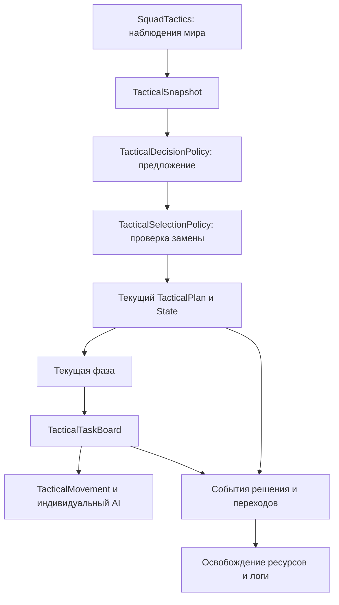

# Архитектура тактики отряда

Модуль `combat/tactics` управляет наземным манёвром одного отряда: выбирает поведение, отслеживает его фазы и выдаёт задания NPC. Индивидуальные поведения SmartBrainLib исполняют задания через существующие навигацию, оружие и механики укрытия.

Рефакторинг отделяет жизненный цикл и владение данными от расчётов тактики. Баланс и качество атак требуют отдельной игровой проверки; наличие классов State и прошедших автоматических тестов само по себе их не подтверждает.

## State и Strategy

State собирает поведение и данные текущего состояния, включая вход, обновление, выход и условия перехода. Такой подход описан в [Game Programming Patterns, State](https://github.com/munificent/game-programming-patterns/blob/master/book/state.markdown) и [официальном руководстве Unity](https://learn.unity.com/tutorial/develop-a-modular-flexible-codebase-with-the-state-programming-pattern?version=6.0).

Strategy выделяет заменяемый алгоритм за интерфейсом; клиент использует его, сохраняя собственную структуру. Применение к игровым алгоритмам рассмотрено в [официальном руководстве Unity по Strategy](https://learn.unity.com/tutorial/strategy-pattern?version=6.0).

В этом проекте сочетание используется так:

| Ответственность | Реализация |
|---|---|
| Текущий манёвр и его прогресс | `TacticalPlan` и отдельный экземпляр `TacticalState` |
| Фаза манёвра и переходы | `TacticalPhaseMachine` и объекты фаз |
| Алгоритм предложения манёвра | Заменяемый `TacticalDecisionPolicy`; стандартная реализация — `TacticalRules` |
| Алгоритм ограничений и оценки позиции | `TacticalPositionPolicy`, предоставляемый состоянием |
| Исполнение индивидуального задания | `TacticalMovement`, `TacticalPositions` и существующие AI-поведения |

Сейчас геометрия и распределение групп остаются в классах манёвров. Обходы используют общую механику `FlankingState`, отдельные состояния выбирают геометрию через `anchor`. Полностью заменяемой стратегии построения всего манёвра с переключением на лету пока нет.

При добавлении вариантов одного манёвра подходящая следующая граница — стратегия расчёта групп и геометрии. Она должна возвращать результат расчёта; состояние применяет его, хранит прогресс и принимает решение о переходе. Это проектное правило разделения ответственности, а не требование самого паттерна Strategy. Если появляются новые данные текущего манёвра, они принадлежат его экземпляру, а не глобальному singleton алгоритма.

## Карта файлов

Все ссылки ниже ведут в `src/main/kotlin/com/sbwnpc/squad/combat/tactics/`.

| Файл | Ответственность |
|---|---|
| [SquadTactics.kt](../src/main/kotlin/com/sbwnpc/squad/combat/tactics/SquadTactics.kt) | Адаптер мира: собирает наблюдения, запускает оценку и предоставляет API индивидуальному AI |
| [TacticalModel.kt](../src/main/kotlin/com/sbwnpc/squad/combat/tactics/TacticalModel.kt) | Идентификаторы манёвров, снимок наблюдений, контакт, участник и предложение решения |
| [SquadTacticalState.kt](../src/main/kotlin/com/sbwnpc/squad/combat/tactics/SquadTacticalState.kt) | Память отряда, оценка ситуации, замена и отмена плана, восстановление после отказа |
| [TacticalRules.kt](../src/main/kotlin/com/sbwnpc/squad/combat/tactics/TacticalRules.kt) | Стандартные правила предложения манёвра |
| [TacticalSelectionPolicy.kt](../src/main/kotlin/com/sbwnpc/squad/combat/tactics/TacticalSelectionPolicy.kt) | Условия принятия или отклонения замены текущего плана |
| [TacticalStates.kt](../src/main/kotlin/com/sbwnpc/squad/combat/tactics/TacticalStates.kt) | Полный реестр фабрик состояний и их политик устойчивости |
| [TacticalPlan.kt](../src/main/kotlin/com/sbwnpc/squad/combat/tactics/TacticalPlan.kt) | Идентичность плана и обязательный жизненный цикл его состояния |
| [TacticalState.kt](../src/main/kotlin/com/sbwnpc/squad/combat/tactics/TacticalState.kt) | Контракт состояния, общие ограничения назначений, роли медика и защитника |
| [TacticalPhases.kt](../src/main/kotlin/com/sbwnpc/squad/combat/tactics/TacticalPhases.kt) | Объекты фаз, временные данные фаз, разрешённые переходы |
| [CoveredManeuverState.kt](../src/main/kotlin/com/sbwnpc/squad/combat/tactics/CoveredManeuverState.kt) | Общая последовательность движения с прикрытием, паузой и поиском огневого прохода |
| [FlankingStates.kt](../src/main/kotlin/com/sbwnpc/squad/combat/tactics/FlankingStates.kt) | Обход, окружение, вытеснение и сосредоточение на секторе; порядок волн и прибывшие участники |
| [HeightAttackState.kt](../src/main/kotlin/com/sbwnpc/squad/combat/tactics/HeightAttackState.kt) | Наступление на высоту и подтягивание прикрытия |
| [BoundingStates.kt](../src/main/kotlin/com/sbwnpc/squad/combat/tactics/BoundingStates.kt) | Перебежки и ограниченное преследование |
| [WithdrawalStates.kt](../src/main/kotlin/com/sbwnpc/squad/combat/tactics/WithdrawalStates.kt) | Разрыв контакта, перегруппировка, уход от бронетехники |
| [FileState.kt](../src/main/kotlin/com/sbwnpc/squad/combat/tactics/FileState.kt) | Последовательное прохождение узкого участка |
| [HoldingStates.kt](../src/main/kotlin/com/sbwnpc/squad/combat/tactics/HoldingStates.kt) | Удержание, переориентация, наблюдение, поиск, ответный огонь, противотанковые назначения и уклонение |
| [TacticalTaskBoard.kt](../src/main/kotlin/com/sbwnpc/squad/combat/tactics/TacticalTaskBoard.kt) | Единственный владелец состава заданий: замена, сохранение, отмена и исключение участника |
| [TacticalTask.kt](../src/main/kotlin/com/sbwnpc/squad/combat/tactics/TacticalTask.kt) | Задание и прогресс его индивидуального исполнения, поиска и маршрута |
| [TacticalMovement.kt](../src/main/kotlin/com/sbwnpc/squad/combat/tactics/TacticalMovement.kt) | Движение, приоритеты других поведений, повторные попытки и отказ конкретного задания |
| [TacticalPositions.kt](../src/main/kotlin/com/sbwnpc/squad/combat/tactics/TacticalPositions.kt) | Поиск достижимой позиции с проверками геометрии, видимости и огневой линии |
| [TacticalPositionPolicy.kt](../src/main/kotlin/com/sbwnpc/squad/combat/tactics/TacticalPositionPolicy.kt) | Ограничения и дополнительные оценки позиции для манёвра |
| [TacticalEvidence.kt](../src/main/kotlin/com/sbwnpc/squad/combat/tactics/TacticalEvidence.kt) | Готовность прикрытия, фактический огонь и достижение назначенного места |
| [TacticalEvents.kt](../src/main/kotlin/com/sbwnpc/squad/combat/tactics/TacticalEvents.kt) | Структурированные события и необязательный ограниченный буфер трассировки |
| [TacticalRuntimeEvents.kt](../src/main/kotlin/com/sbwnpc/squad/combat/tactics/TacticalRuntimeEvents.kt) | Синхронное освобождение ресурсов мира и отправка событий в лог |
| [TacticalEventFormat.kt](../src/main/kotlin/com/sbwnpc/squad/combat/tactics/TacticalEventFormat.kt) | Имена и формат полей диагностических событий |
| [TacticalCoordinator.kt](../src/main/kotlin/com/sbwnpc/squad/combat/tactics/TacticalCoordinator.kt) | Узкие точки входа жизненного цикла для адаптера и сценарных тестов |
| `TacticalTerrain`, `TacticalRoutes`, `TacticalFlanks`, `DefensiveOverwatch`, `TacticalBudget`, `TacticalTelemetry` | Оценка местности, геометрия подхода, поддерживающие позиции, бюджет и сводная диагностика |

## Владение данными

На один `Squad` приходится один `SquadTacticalState`. Он хранит контакты, текущий снимок, cooldown после отказа и ссылку на план.

Каждый новый `TacticalPlan` получает **новый экземпляр состояния** из реестра. Общие базовые классы переиспользуют алгоритмы, но их изменяемые поля принадлежат отдельному плану: порядок обхода, прибывшие участники, поддерживающая группа, число перебежек, исходная точка. Повторное присоединение одного экземпляра State к другому плану запрещено.

Фаза отдельно хранит временные данные: например, `PausedPhase` — начало паузы и сохранённое активное время, `OpeningLanePhase` — список разведчиков. Статус и текущая фаза доступны только для чтения. Старые значения `TacticalStatus` сохранены как проекция для потребителей: и `PAUSED`, и `WITHDRAWING` отображаются как `REGROUPING`, поэтому при диагностике нужно смотреть `statePhase`.

Реестр создаёт отдельные пробные экземпляры для чтения политик. Конструкторы State должны только инициализировать данные: доступ к миру и регистрация побочных эффектов в конструкторе недопустимы.

## Обновление и жизненный цикл



`SquadTacticalBehaviour` работает в Core-группе Brain. `SquadTactics.refresh` собирает наблюдения раз в 10 игровых тиков на отряд; новый `orderStamp` обходит ожидание. Чистая часть модуля использует переданный `TacticalSnapshot`, без поиска сущностей и лучей мира.

`assess` предлагает манёвр, применяет cooldown и проверяет условия замены. Новый приказ, терминальный план и разрешённая аварийная смена обходят соответствующие ограничения устойчивости. Время удержания и предел фазы задаются через `TacticalStability`, а не списками enum в контроллере.

При принятой замене сначала создаётся и проверяется новый экземпляр State. Ошибка фабрики сохраняет текущий план и его задания. Затем старый State выходит, его задания освобождаются, и новый план активируется. `enter` вызывается один раз; последующие оценки вызывают `tick`. `exit` идемпотентен, вышедший план больше не обновляется. Во время замены наблюдателям запрещено повторно запускать выбор плана или деактивацию.

Базовые `TacticalState.enter/tick/exit` закрепляют обязательные действия. Расширение выполняется через `onEnter`, `beforeTick`, `afterTick`, `onExit`, построение `task`, а для покрытого манёвра — `prepare`, `execute`, `arrived` и фазовые события. `TacticalContext.fail` передаёт отказ владельцу текущего плана, чтобы тот одновременно установил cooldown и освобождал задания. Отказ при входе также завершает план: первоначальные назначения и последующий `tick` уже не выполняются.

## Фазы

| Фаза | Назначение | Допустимые следующие фазы |
|---|---|---|
| `PREPARING` | Подготовка задания и ожидание нужного прикрытия | `EXECUTING`, `WITHDRAWING`, `OPENING_LANE` |
| `OPENING_LANE` | Ограниченная попытка открыть огневой проход разведчиками | `PREPARING` |
| `EXECUTING` | Движение или активное удержание согласно State | `PREPARING`, `PAUSED`, `EXECUTING` для следующей группы |
| `PAUSED` | Остановка движения после потери прикрытия | `EXECUTING` |
| `WITHDRAWING` | Движение от угрозы | `PREPARING`, `WITHDRAWING` |
| `COMPLETED` | Завершение; назначения остаются до замены плана | Терминальная |
| `FAILED` | Отказ; назначения освобождаются сразу | Терминальная |

Из любой нетерминальной фазы также разрешены `COMPLETED` и `FAILED`. Проверка графа находится в `TacticalPhaseMachine`. Переход последовательно выполняет выход из старой фазы, фиксирует следующую и выполняет её вход. Повторный переход изнутри незавершённого перехода запрещён.

Условия переходов размещены в соответствующем State и фазах. Прикрытие проверяется отдельно как готовность стрелять и как факт недавнего огня в назначенном секторе. При паузе активное время движения сохраняется. Все часы используют игровые тики из снимка.

## Задания, отмена и приоритеты

Изменять состав заданий можно через `TacticalTaskBoard`. Он проверяет принадлежность заданий плану до замены, исключает отказавшихся участников и выдаёт событие освобождения для каждого удалённого задания. Карта заданий снаружи доступна только для чтения.

`retainCover` сохраняет **тот же объект** задания прикрытия между фазами: его найденную позицию, прогресс поиска и маршрут. Это предотвращает отмену полезной работы только из-за начала очередной волны.

`TaskReleased` синхронно освобождает `FiringSpots` и останавливает навигацию, только если её текущий `Path` — именно тот объект, который запустило освобождаемое задание. Новый маршрут от другого поведения сохраняется. Освобождение работает и при выключенных логах; потеря диагностических записей в буфере не влияет на очистку ресурсов.

Удаление, роспуск и удаление пустого отряда вызывают `deactivate` через `SquadManager`. Адаптер также деактивирует план при оценке без подходящих наземных участников. При этом сохранённые контакты доступны для последующего возвращения отряда к работе. Отдельно отсутствие участника в очередном снимке удаляет его назначение.

Индивидуальные действия с более высоким приоритетом — транспорт, специальная роль, снабжение, закрепление, укрытие, лечение и отход — продолжают управлять NPC. `MovementBlocked` объясняет такую блокировку движения. Это диагностическое наблюдение: оно само не меняет таймеры, фазу или маршрут. Пауза всей маневрирующей группы отдельно обозначается `PAUSED` и событиями `TaskPaused`.

Brain продолжает работать через SmartBrainLib: сенсоры, память и поведения остаются основой индивидуального AI. Эти роли соответствуют [описанию Brain в официальной wiki SmartBrainLib](https://github.com/Tslat/SmartBrainLib/wiki/How-do-Brains-Work). Переход к тактическому State не заменяет оружейные и аварийные поведения.

## Как добавить манёвр

1. Добавь идентификатор в `TacticalPattern` и класс, наследующий `TacticalState` или подходящее семейство: `FlankingState`, `BoundingState`, `WithdrawalState`, `CoveredManeuverState`.
2. Определи политику устойчивости и назначения. Данные прогресса храни в экземпляре State. Чистый алгоритм оценки позиции предоставь через `TacticalPositionPolicy`.
3. Для нового покрытого манёвра реализуй `task` и `arrived`; общая подготовка, пауза и таймауты уже есть в базовом классе. Переходы проводи через `phases.transition`, завершение и отказ — через API плана и контекста.
4. Зарегистрируй фабрику, возвращающую новый экземпляр. Реестр требует реализации каждого идентификатора и не подменяет отсутствующий манёвр поведением по умолчанию.
5. Добавь условие выбора в `TacticalRules` либо другую реализацию `TacticalDecisionPolicy`. Правила выбора возвращают предложение и причину, не меняя текущий план напрямую.
6. Проверь сценарий перехода, завершение или отказ, смену приказа и независимость двух отрядов. Потом проверь достижимость, стрельбу и совместимость с укрытиями в игре.

Пример заменяемой политики позиции, сохраняющей верхнюю площадку для обычного состояния удержания:

```kotlin
val highGround = object : TacticalPositionPolicy {
    override fun candidate(
        view: TacticalSnapshot, task: TacticalTask,
        point: Vec3, localAnchor: Vec3
    ) = point.y >= view.center.y - 1.0

    override fun route(view: TacticalSnapshot, point: Vec3) =
        point.y >= view.center.y - 1.0
}

val registry = TacticalStates.registry.replacing(TacticalPattern.HOLD_HEIGHT) {
    object : TacticalState() {
        override val positions = highGround
        override val supportsDefensiveOverwatch = true
        override fun task(layout: TacticalLayout, member: TacticalMember, index: Int) =
            layout.cover(member)
    }
}

val controller = SquadTacticalState(registry = registry)
```

Это пример альтернативной конфигурации контроллера для теста или нового подключения. Рабочий `Squad` сейчас создаёт стандартный контроллер. Для постоянного изменения его фабрики редактируется стандартный реестр `TacticalStates`; пример сам по себе не заменяет контроллер существующего отряда.

Если нужен новый вид фазы, добавь объект фазы, идентификатор и допустимые переходы в `TacticalPhases.kt`, затем тест границ переходов. Конкретный манёвр с уже существующими фазами не требует нового фазового графа.

## Логи

Тактика использует группу `order`. В debug-сборке её включает строка `logGroups = ["order"]` в `config/sbwnpc-debug.toml`. Проверка доступности логов находится в `DebugFlags.on`; форматирование выполняется после неё.

| Событие | Что объясняет |
|---|---|
| `plan_selected` | Выбранный манёвр, причина решения, предыдущий план, приказ и триггер замены |
| `selection_held` | Предложенный и текущий манёвр, причина отклонения замены; повтор одной причины ограничен 100 тиками |
| `state_enter/exit`, `phase_enter/exit` | Начало и завершение соответствующего жизненного цикла |
| `transition` | Предыдущая и следующая фаза, триггер, число участников, видимых контактов, прикрывающих и движущихся |
| `task_assigned/released` | NPC, его работа и назначенная позиция либо причина отмены |
| `task_paused/resumed` | Реальная остановка или возобновление тактического движения из-за паузы манёвра |
| `movement_blocked/unblocked` | Изменение индивидуальной причины: `COVER`, `MEDIC`, `SUPPLY`, `ROLE_TASK` и другие |
| `snapshot` | Сводное состояние: класс State, точная фаза, готовность, огонь, местность и распределение заданий; раз в 100 тиков и при изменении плана/фазы/волны |

У каждого структурированного события есть `squad`, `tick`, `plan`. У перехода:

- `coverAssigned` — число назначенных прикрывающих;
- `coverReady` — число способных прикрывать назначенный сектор;
- `coverFired` — число недавно стрелявших и способных прикрывать этот сектор;
- `movers` и `settledMovers` — назначенные движущиеся и достигшие места.

Доказательства перехода собираются до смены фазы и очистки заданий. По ним можно отличить отсутствие прикрывающей группы от отсутствия реального огня у назначенных стрелков.

Пример полей события, без служебного префикса игрового логгера:

```text
[tactics] Alpha squad=<uuid> tick=110 plan=1 event=transition from=EXECUTING to=PAUSED trigger=cover_lost_pause members=6 visible=1 coverAssigned=3 coverReady=0 coverFired=0 movers=3 settledMovers=0
```

`TacticalEventBuffer` предназначен для ограниченного сбора трассировки и сообщает число потерянных записей при переполнении. Исполнитель освобождения ресурсов подключается напрямую через `TacticalEventStream.runtime`. Наблюдатели событий должны собирать диагностику, сохраняя управление переходами у контроллера и текущего State.

## Проверка и пределы рефакторинга

Сценарные тесты находятся в [src/test/kotlin/com/sbwnpc/squad/combat/tactics/](../src/test/kotlin/com/sbwnpc/squad/combat/tactics/). `TacticalLifecycleTest` проверяет изоляцию состояний, обязательный жизненный цикл, смену приказов, терминальные фазы и отмену. `TacticalDiagnosticsTest` проверяет доказательства переходов и различие групповой паузы и индивидуальной блокировки. Отмена через менеджер покрыта в `SquadManagerTest`.

Рефакторинг сохраняет исходные правила выбора, геометрию и числовые ограничения манёвров. Исправлены границы жизненного цикла: терминальные планы перестают обновляться, отмена явно освобождает ресурсы, временные подрежимы стали отдельными фазами. Эти изменения также требуют игровой проверки.

Предыдущие экспериментальные изменения огневого фронта сохранены отдельно в локальной ветке `wip/squad-fire-front` и не включены в этот рефакторинг. Настройка групп, флангов и эффективности атаки выполняется следующим этапом, после проверки новой структуры. Текущие планы и прогресс исполнения не сериализуются в NBT.
